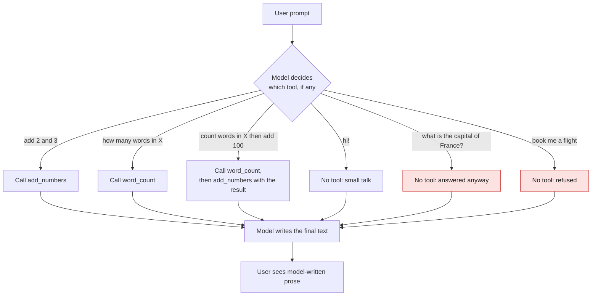

# 001 - Mapping Intent

> Last updated: 2026-08-29 | Verified against: pydantic-ai 2.35.0, Python 3.14.3
> Difficulty: Beginner | Estimated time: 15 minutes

A minimal Pydantic AI agent that turns a plain-English request into the right **tool call**, then
answers using the result. It is the smallest complete demonstration of intent mapping: you never
write an intent classifier, a keyword matcher, or a routing table. You describe two functions, and
the model decides which one the user meant.

This is the hands-on companion to
[`../../../001-agentic-ai-basics.md`](../../../001-agentic-ai-basics.md), specifically the sections on
the core agent loop, agent anatomy, and the "same problem at all three levels" comparison of
intent recognition.

**What it demonstrates**

- Tool selection *is* intent recognition. The tool the model picks is the intent it inferred.
- The reason -> act -> observe loop, running for real and visible in the response stream.
- Multi-step chaining: the output of one tool feeding the input of the next, with no orchestration
  code written by you.
- A zero-cost offline path (`TestModel`) so the mechanics can be exercised with no API key.
- Why a scope guard written in the system prompt is advisory rather than enforced, shown with a
  case where it fires and a case where it does not.

---

## Files

| File | Purpose |
| --- | --- |
| `agent.py` | The agent: model selection, system prompt, and the two tools. The only file with logic. |
| `web.py` | Serves the agent as a browser chat UI. One line: `app = agent.to_web()`. |
| `.env` | Holds `OPENAI_API_KEY`. Git-ignored, never committed. |

The two tools are deliberately trivial, so nothing distracts from the routing behaviour:

```python
@agent.tool_plain
def add_numbers(a: int, b: int) -> int:
    """Add two numbers together."""

@agent.tool_plain
def word_count(text: str) -> int:
    """Count how many words are in a text."""
```

The docstring is not a comment. It is the description the model reads to decide when the tool
applies, and it is the main lever you have over routing accuracy.

`agent.py` also carries a system prompt that sets the persona and asks the agent to refuse
out-of-scope requests and list what it can do. That instruction changes real behaviour, and its
limits are documented in [The scope guard is advisory](#the-scope-guard-is-advisory).

---

## Setup

```bash
pip install "pydantic-ai" "python-dotenv" "uvicorn"
```

Verified with `pydantic-ai==2.35.0`, `python-dotenv==1.2.2`, `uvicorn==0.52.4`, `openai==3.3.1`
on Python 3.14.3.

Create `.env` in this directory for the real-model path:

```
OPENAI_API_KEY=sk-...
```

**No key is required.** Without one, `agent.py` falls back to Pydantic AI's `TestModel`, which runs
offline and free. See [Testing](#testing).

---

## How to run

```bash
python -m uvicorn web:app --reload
```

Then open http://127.0.0.1:8000.

Use `python -m uvicorn`, not the bare `uvicorn` command. The console script is not always on `PATH`
(it is not in Git Bash on Windows), which fails with `uvicorn: command not found`, exit 127. The
`python -m` form works from any shell and any venv state.

On startup you will see which model path is active:

```
Using real model                                   <- OPENAI_API_KEY was found
INFO:     Uvicorn running on http://127.0.0.1:8000 (Press CTRL+C to quit)
```

If port 8000 is taken, pass another: `python -m uvicorn web:app --port 8001`.

---

## How a request flows

Every prompt reaches the same decision point, and every reply is written by the model. The two red
nodes are where the system prompt's scope guard is supposed to act; the diagram shows it firing in
one case and not the other.



Read the bottom of the diagram carefully: **every path converges on "Model writes the final text"**.
Nothing in this design constrains what that text says, which is why the guard is advisory and why
the refusal in case 6 can list capabilities that do not exist. Case 3 is the only branch that loops,
feeding one tool's result into the next.

---

## Sample requests and real responses

Every response below was produced by running these exact prompts against `openai:gpt-5` with the
system prompt currently in `agent.py`. Model output is not deterministic, so your wording will
differ; the tool selection is the part that matters.

The system prompt shapes every answer here, so it is worth reading first:

```
You are a friendly study-buddy agent for beginners. Keep answers short and encouraging.
if you got an intent that does not match the existing ones, tell the requestor swiftly
that you can't do that & list what you can
```

### 1. Single tool: arithmetic

| | |
| --- | --- |
| **Prompt** | `add 2 and 3` |
| **Tool selected** | `add_numbers` with `{"a": 2, "b": 3}` |
| **Tool returned** | `5` |
| **Answer** | `2 + 3 = 5. Nice!` |

The model extracted the operands and mapped the request to a function it had never been shown an
example of.

### 2. Single tool: text

| | |
| --- | --- |
| **Prompt** | `how many words are in 'the quick brown fox jumps'?` |
| **Tool selected** | `word_count` with `{"text": "the quick brown fox jumps"}` |
| **Tool returned** | `5` |
| **Answer** | `5 words. Nice!` |

Note it passed only the quoted span as `text`, not the whole prompt. Argument extraction is part of
what the model is doing, and it is easy to miss.

### 3. Two tools chained

| | |
| --- | --- |
| **Prompt** | `count the words in 'I am learning pydantic ai' and then add 100 to that count` |
| **Tools selected** | `word_count` with `{"text": "I am learning pydantic ai"}` -> returned `5`<br>`add_numbers` with `{"a": 100, "b": 5}` -> returned `105` |
| **Answer** | `Word count: 5`<br>`5 + 100 = 105`<br>`Nice work!` |

This is the loop doing its job. The `5` in the second call did not exist when the first call was
made; the model observed the result and used it as the next input. No chaining code was written.

### 4. No tool: small talk

| | |
| --- | --- |
| **Prompt** | `hi!` |
| **Tool selected** | none |

```
Hey! 😊 I'm your study buddy. I can:
- Explain concepts in simple steps
- Make quick quizzes or summaries
- Help with practice problems
- Count words or add numbers

What are you working on today?
```

The capability list comes from the system prompt's "list what you can" instruction. Read it
carefully: only the last item is real. See [The scope guard is advisory](#the-scope-guard-is-advisory).

### 5. Out of scope, but answered anyway

| | |
| --- | --- |
| **Prompt** | `what is the capital of France?` |
| **Tool selected** | none |
| **Answer** | `Paris. Great question! Want a quick fun fact about it?` |

The system prompt says to refuse intents that do not match the existing ones. It did not refuse.
This is not a bug in the prompt; it is what prompt-based guardrails do.

### 6. Out of scope, refused

| | |
| --- | --- |
| **Prompt** | `book me a flight to Cairo next Tuesday` |
| **Tool selected** | none |

```
Sorry-I can't book flights. But I can help with:
- Explaining concepts simply
- Making study plans
- Creating flashcards and quizzes
- Summarizing notes/readings
- Step-by-step problem solving
- Brainstorming/outlining essays

If you'd like, I can draft a quick message to send to a travel agent or site for that Cairo flight.
```

Here the guard fired. Note that not one item in that list is a real capability: the agent has
exactly two tools, `add_numbers` and `word_count`, and neither appears.

### The scope guard is advisory

Cases 5 and 6 are the same instruction producing opposite outcomes. "Refuse intents that do not
match" fired for flight booking and not for a geography question, because the model judges what
counts as out of scope, and general knowledge feels in scope for a study buddy.

Two things follow, and they are the most useful lessons on this page:

1. **A system prompt is an instruction, not a gate.** It competes with everything else in context.
   If a request must be refused, refuse it in code before the model is called, or validate the
   output afterwards. Do not rely on the prompt alone.
2. **"List what you can" invents capabilities.** The model has no grounded inventory of itself; it
   sees two tool descriptions and improvises a plausible study-buddy menu around them. Flashcards
   and study plans do not exist. To list real capabilities, build the list from the tool names in
   code and put it in the prompt, rather than asking the model to recall it.

Both problems are fixed in [`../002-mapping-intent-enforced`](../002-mapping-intent-enforced), which
constrains the model to a typed intent and lets code own the refusal wording.

### Routing is probabilistic, not a lookup

Prompt 2 was run twice under an earlier system prompt. The first run answered `5 words! Nice and
snappy.` **without calling `word_count`**; the model counted the words itself. The second run used
the tool. Same prompt, same model, different route.

Tool selection is a model judgment, not a dispatch table. For tasks the model can do unaided, it may
skip your tool entirely. If a tool must always run, enforce it in code rather than asking for it.

Note also that the routing surface is wider than the tool docstrings: changing only the system
prompt changed the answers to cases 4, 5, and 6 without touching a single tool.

---

## HTTP API

`agent.to_web()` mounts four routes. Useful when driving the agent from something other than the
browser UI.

| Method | Path | Purpose |
| --- | --- | --- |
| `GET` | `/` | The chat UI |
| `GET` | `/api/health` | Liveness check |
| `GET` | `/api/configure` | Models and tools the UI may offer |
| `POST` | `/api/chat` | Send a message, receive a streamed response |

```bash
curl -s http://127.0.0.1:8000/api/health
# {"ok":true}

curl -s http://127.0.0.1:8000/api/configure
# {"models":[{"id":"openai:gpt-5","name":"GPT 5","builtinTools":[]}],"builtinTools":[]}
```

`POST /api/chat` speaks the Vercel AI SDK protocol and returns Server-Sent Events. Both `trigger`
and `id` are required; omitting `trigger` returns a 500 with a `union_tag_not_found` validation
error, because the body is a tagged union of `submit-message` and `regenerate-message`.

```bash
curl -N -X POST http://127.0.0.1:8000/api/chat \
  -H "Content-Type: application/json" \
  -d '{
        "trigger": "submit-message",
        "id": "conversation-1",
        "messages": [
          {"id": "m1", "role": "user", "parts": [{"type": "text", "text": "add 2 and 3"}]}
        ],
        "model": "openai:gpt-5"
      }'
```

Real response, with the reasoning and `tool-input-delta` chunks omitted:

```
data: {"type":"start"}
data: {"type":"start-step"}
data: {"type":"tool-input-available","toolName":"add_numbers","input":{"a":2,"b":3}}
data: {"type":"tool-output-available","output":5}
data: {"type":"finish-step"}
data: {"type":"start-step"}
data: {"type":"text-start"}
data: {"type":"text-delta","delta":"2 + 3 = 5. Nice!"}
data: {"type":"text-end"}
data: {"type":"finish"}
```

The `tool-input-available` and `tool-output-available` events are the act and observe halves of the
loop, on the wire. Text deltas arrive token by token; the example above shows them assembled.

---

## Testing

### Offline, free, no API key

`TestModel` calls **every** registered tool once with placeholder arguments, then returns the
collected results. It verifies wiring, not behaviour: that tools are registered, schemas are valid,
and the loop runs.

```python
from pydantic_ai.models.test import TestModel
from agent import agent

with agent.override(model=TestModel()):
    print(agent.run_sync("add 2 and 3").output)
# {"add_numbers":0,"word_count":1}

with agent.override(model=TestModel(call_tools=[])):
    print(agent.run_sync("hi!").output)
# success (no tool calls)
```

The `0` and `1` are placeholders, not answers. `TestModel` passes `a=0, b=0` and `text="a"`. Seeing
both tool names in that output is the assertion worth making: it proves both are visible to the
model.

**Use `agent.override(...)`, not environment variables.** Unsetting `OPENAI_API_KEY` in your test
does nothing, because `agent.py` calls `load_dotenv()` at import time, which reads `.env` and puts
the key straight back. The startup line still prints `Using real model` even in the tests above;
only `override` actually changes the model in use.

### The tools on their own

They are ordinary functions, so no agent is needed:

```python
from agent import add_numbers, word_count

assert add_numbers(2, 3) == 5
assert word_count("a b c") == 3
```

### Against the real model

Requires a key and costs money. Assert on the **tool selected**, not the prose, which varies run to
run:

```python
from pydantic_ai.messages import ToolCallPart
from agent import agent

result = agent.run_sync("add 2 and 3")
tools = [p.tool_name for m in result.all_messages()
         for p in getattr(m, "parts", []) if isinstance(p, ToolCallPart)]
assert "add_numbers" in tools
```

Given the non-determinism shown above, treat a single run as a sample rather than a pass.

---

## Troubleshooting

| Symptom | Cause | Fix |
| --- | --- | --- |
| `uvicorn: command not found` (exit 127) | Console script not on `PATH` | Use `python -m uvicorn web:app` |
| `[Errno 10048] only one usage of each socket address` | Port already bound | `--port 8001`, or stop the other process |
| `UnicodeEncodeError: 'charmap' codec can't encode` | Windows console is cp1252 and a reply contained an emoji | Run with `PYTHONIOENCODING=utf-8` |
| 500 on `/api/chat`, `union_tag_not_found` | Body missing `trigger` and `id` | Add `"trigger": "submit-message"` and an `id` |
| `Using real model` printed during tests | `load_dotenv()` restores the key from `.env` | Use `agent.override(model=TestModel())` |
| 404 from the API on the first message | Account lacks access to `openai:gpt-5` | Change `MODEL` in `agent.py:13` |
| Tool never fires | Model judged it unnecessary, or the docstring is unclear | Rewrite the docstring as an instruction; see "Routing is probabilistic" |
| Out-of-scope request answered instead of refused | The system-prompt guard is advisory, not a gate | Enforce in code before or after the model call; see "The scope guard is advisory" |
| Agent claims capabilities it does not have | "List what you can" makes the model improvise a plausible menu | Build the list from real tool names in code and inject it into the prompt |

---

## Things to try next

1. Add a third tool and watch whether the model still routes cleanly. Ambiguity between tool
   descriptions is where routing accuracy degrades first.
2. Reword a docstring to something vague and observe the routing get worse. This is the fastest way
   to internalise that descriptions are prompt engineering.
3. Ask for something needing a tool you have not defined, and see how the model handles the gap.
4. Swap `MODEL` to a smaller model and compare routing quality against cost.
