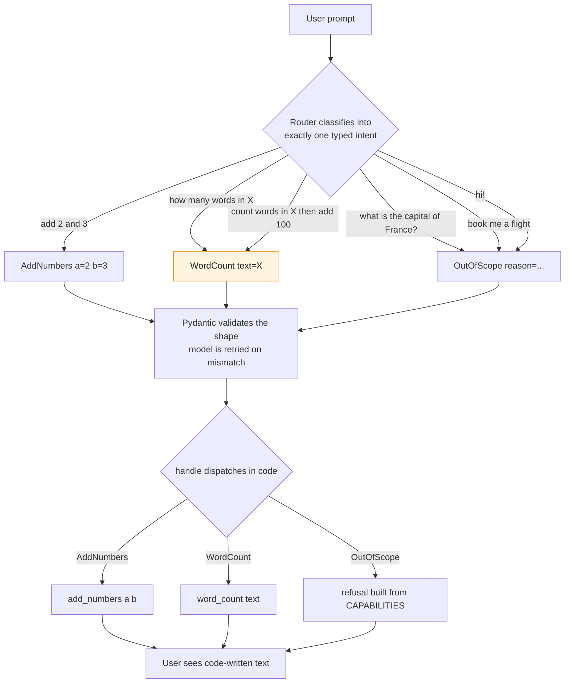
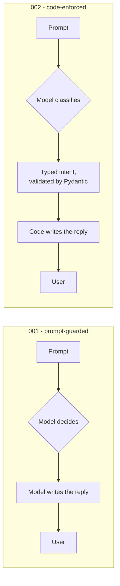
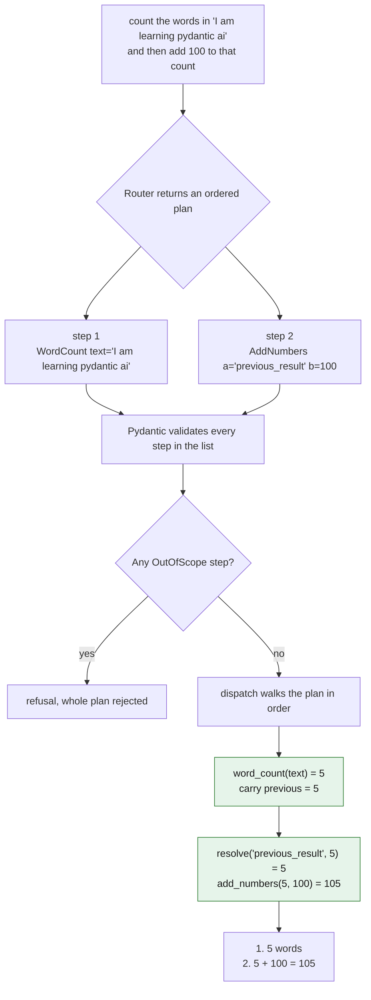

# 002 - Mapping Intent, Enforced

> Last updated: 2026-08-29 | Verified against: pydantic-ai 2.35.0, Python 3.14.3
> Difficulty: Beginner | Estimated time: 15 minutes

The sequel to [`../001-mapping-intent`](../001-mapping-intent), which asks the model in its system
prompt to refuse out-of-scope requests. That version demonstrated two failures, both reproduced with
real runs:

- `what is the capital of France?` matched no tool and was **answered anyway**
- when it did refuse, it listed capabilities it does not have (flashcards, study plans, quizzes)

This version fixes both by moving the decision's *consequences* into code. The model no longer
writes the answer. It only classifies.

**The idea in one line:** shrink what the model is allowed to *return*, rather than instructing it
more firmly.

The folder holds two versions of that idea. Read them in order:

| File | Model returns | Compound prompts | Mixed in-scope + out-of-scope |
| --- | --- | --- | --- |
| `agent-single-intent.py` | one `Intent` | truncated, unpredictably | answers the in-scope half, drops the rest silently |
| `agent-multi-intents.py` | `list[Intent]`, ordered | chained, step by step | **refuses the whole plan**, see [the limitation](#limitation-one-out-of-scope-step-refuses-the-whole-plan) |

Everything down to [The costs, honestly](#the-costs-honestly) describes the single-intent version.
[Lifting the limit](#lifting-the-limit-many-intents-per-prompt) covers the multi-intent one.

---

## How it works

The model must return exactly one of three validated shapes:

```python
class AddNumbers(BaseModel):
    kind: Literal["add_numbers"]
    a: int
    b: int

class WordCount(BaseModel):
    kind: Literal["word_count"]
    text: str

class OutOfScope(BaseModel):
    kind: Literal["out_of_scope"]
    reason: str

Intent = Union[AddNumbers, WordCount, OutOfScope]

router = Agent(MODEL, output_type=Intent, system_prompt="Classify ... return out_of_scope.")
```

Then plain Python decides what happens:

```python
def dispatch(intent: Intent) -> str:      # pure, no model
    if isinstance(intent, AddNumbers):
        return f"{intent.a} + {intent.b} = {add_numbers(intent.a, intent.b)}"
    if isinstance(intent, WordCount):
        return f"{word_count(intent.text)} words"
    return refusal()


def handle(prompt: str) -> str:
    return dispatch(router.run_sync(prompt).output)
```

`output_type` makes the union an *output tool*. Pydantic validates the model's response against it
and retries the model automatically if the shape does not match, so `handle()` can never receive
anything but one of the three types.

---

## What `router` is

`router` is an ordinary `pydantic_ai.Agent`, the same class as `agent` in 001. The name is mine, not
a framework concept: there is no `Router` type in Pydantic AI. It is called that because of the job
it does, which is decide *where* a request goes rather than *what to say* about it.

```python
router = Agent(
    MODEL,
    output_type=Intent,
    system_prompt="Classify the user's request into exactly one intent. "
                  "If it is not addition or word counting, return out_of_scope.",
)
```

Two things make it a router rather than a chat agent, and both are visible in that call:

**1. `output_type=Intent` replaces free text with a schema.** Pydantic AI turns the union into an
*output tool*: the model is handed a JSON Schema and must produce a value matching it. Asking the
agent what it expects shows exactly what the model sees:

```python
router.output_json_schema()
# {'anyOf': [ {...AddNumbers...}, {...WordCount...}, {...OutOfScope...} ]}
```

Each variant carries its `kind` as a `const`, its fields as `required`, and **its class docstring as
the schema `description`**:

```text
AddNumbers  -> "The user wants two numbers added."
WordCount   -> "The user wants the words in a piece of text counted."
OutOfScope  -> "The request matches no supported intent."
```

Those docstrings are not documentation. They are how the model decides which variant a prompt
belongs to, exactly as tool docstrings do the routing in 001. If classification goes wrong, rewrite
them before you touch anything else.

**2. It has no tools at all.** In 001, `add_numbers` and `word_count` are registered with
`@agent.tool_plain`, so the model calls them. Here they are plain functions the model has never
heard of, invoked by `handle()` after classification. Confirmed on the live object:

```python
isinstance(router, Agent)   # True, it is just an Agent
# function tools registered: NONE
```

So `router` is the one and only place the model appears in this program. Everything after
`router.run_sync(prompt).output` is ordinary Python:

```python
intent = router.run_sync(prompt).output   # <- the model's entire contribution
```

That single line is the whole reason the guard holds. The model's influence ends when it returns a
validated object, and `handle()` takes over from there.

---

## How a request flows

The model's only job is to pick one of three shapes. Validation happens before any code runs, and
every string the user reads is written by a handler, never by the model.



Three prompts collapse onto `OutOfScope` and are refused identically, which is the enforcement
working. The amber node is the known weakness: the compound prompt and the plain word-count prompt
both become a single `WordCount`, so the "add 100" half is dropped without an error. See
[Compound requests collapse](#compound-requests-collapse).

---

## How this differs from 001

The two folders answer the same prompts with the same two capabilities. The difference is **where
the final text comes from**.



In 001 the model is the author and the guard is a request in the system prompt, so it holds only
when the model agrees. In 002 the model is a classifier whose output is a schema, and the author is
`handle()`, so the guard cannot be talked out of.

| | 001 | 002 |
| --- | --- | --- |
| Model's job | decide **and** write the answer | classify only |
| Model's output surface | any string | one of three schemas |
| Who writes what the user reads | the model | `handle()` and `refusal()` |
| Scope guard lives in | the system prompt | the type union and the dispatch |
| Guard can be ignored | yes, and it was, on the France prompt | no, there is no other branch |
| Capability list | model recalls it, and invents entries | built from `CAPABILITIES` in code |
| Tools | registered with `@agent.tool_plain` | plain functions, no registration |
| Wrong output shape | not a concept, prose is prose | Pydantic rejects it and retries the model |
| Multi-step chaining | yes, one tool feeds the next | not in `agent-single-intent.py`; yes in `agent-multi-intents.py`, via `previous_result` |
| Small talk | handled conversationally | refused |
| Interface | chat UI at `web.py` | CLI at `main.py` |

**What did not change:** the model still decides which intent a prompt belongs to, so a
misclassification is still possible in both. Enforcement did not make the judgment reliable. It made
the *consequences* of that judgment bounded, which is the only part code can own.

---

## Files

| File | Purpose |
| --- | --- |
| `agent-single-intent.py` | One intent per prompt. The types, the router, and the code-owned handlers. |
| `agent-multi-intents.py` | An ordered `list[Intent]` per prompt, so compound requests chain. |
| `main.py` | CLI runner for both. No arguments replays the samples below; `--multi` selects the multi-intent router; pass a prompt to try your own. |
| `.env` | Holds `OPENAI_API_KEY`. Git-ignored. |
| `.env-sample` | Committed template. Copy to `.env` and set your key. |
| `python-basics.md` | Companion note: every Python language feature the two agent files use, explained. No AI content. |

If the Python itself is the unfamiliar part rather than the agent framework, read
[`python-basics.md`](python-basics.md) first. It walks the same two files feature by feature
and assumes nothing.

There is deliberately **no `web.py`** here. An enforced router is a classifier plus a dispatcher,
not a chat agent, so a chat UI would misrepresent it. See [Which one to use](#which-one-to-use).

---

## Setup and running

```bash
pip install "pydantic-ai" "python-dotenv"

python main.py                                  # single-intent, sample prompts
python main.py "add 40 and 2"                   # single-intent, your prompt
python main.py --multi                          # multi-intent, sample prompts
python main.py --multi "count words in 'a b c' then add 10"
```

Both agent files are kebab-case to match the repo convention, and a hyphen is not a legal Python
identifier, so `import agent-multi-intents` is a syntax error. `main.py` loads them by path with
`importlib` instead, which is what `import` does underneath anyway:

```python
spec = importlib.util.spec_from_file_location("agent_multi_intents", path)
module = importlib.util.module_from_spec(spec)
spec.loader.exec_module(module)
```

Verified with `pydantic-ai==2.35.0`, `python-dotenv==1.2.2` on Python 3.14.3. Without an
`OPENAI_API_KEY` in `.env`, it falls back to `TestModel` and runs offline for free.

---

## Real results

Produced by running `python main.py` against `openai:gpt-5`.

| Prompt | Intent returned | Reply |
| --- | --- | --- |
| `add 2 and 3` | `AddNumbers{a:2, b:3}` | `2 + 3 = 5` |
| `how many words are in 'the quick brown fox jumps'?` | `WordCount{text:"the quick brown fox jumps"}` | `5 words` |
| `what is the capital of France?` | `OutOfScope` | `Sorry, I can't do that. I can: add two numbers together; count the words in a text.` |
| `book me a flight to Cairo next Tuesday` | `OutOfScope` | same refusal |
| `hi!` | `OutOfScope` | same refusal |

The `reason` field is populated but never shown to the user. It exists for logging:

```text
OutOfScope {'kind': 'out_of_scope', 'reason': 'Question about the capital of France; not addition or word counting.'}
```

Compare the third row with 001, where the same prompt returned `Paris. Great question!`. The guard
now holds because refusing is no longer something the model is asked to remember to do; it is the
only path `handle()` has left when the intent is not one of the two supported ones.

---

## What is actually enforced

The model still picks the variant, so a misclassification is still possible. What became
deterministic:

| Guarantee | Why it holds |
| --- | --- |
| Nothing runs without a valid typed intent | Pydantic validates the shape and retries the model on mismatch |
| The refusal wording is fixed | `refusal()` writes it; the model never sees or produces it |
| The capability list cannot drift | Built from `CAPABILITIES`, alongside the handlers it describes |
| No capability can be invented | The model has no channel to emit prose at all |

That last row is the structural fix. In 001 the model could say anything, so it did. Here its entire
output surface is three schemas, and none of them has a free-text field the user ever reads.

---

## The costs, honestly

### Small talk is refused

`hi!` returns the refusal. There is no conversational path left, because there is no intent for one.
Add a `SmallTalk` variant with a code-owned greeting if you want it back. Do not solve it by letting
the model write prose again; that reopens the exact hole this folder closes.

### Compound requests collapse

This prompt worked in 001, chaining two tools:

```text
count the words in 'I am learning pydantic ai' and then add 100 to that count
```

001 answered `Word count: 5` then `5 + 100 = 105`. `agent-single-intent.py` cannot represent the
request at all, and **which way it fails is not stable**. Ten classifications of that one prompt
against `openai:gpt-5`:

| Intent returned | Frequency | What the user sees |
| --- | --- | --- |
| `OutOfScope` | 5/10 | the refusal, which at least fails loudly |
| `WordCount` | 4/10 | `5 words`, the addition silently dropped |
| `AddNumbers{a:5, b:100}` | 1/10 | `5 + 100 = 105`, **the model counted the words itself** |

That last row is the one to worry about. The schema demands an `int` for `a`, the word count did not
exist yet, so the model computed it and wrote `5` into the operand. It happened to be right. Nothing
in the type system could have told you it was a guess.

This is the real limit of single-intent classification: one prompt maps to one intent, so a request
containing two cannot be represented. Nothing errors, which makes it worse than a failure that
announces itself. Three ways out:

| Approach | Shape | Enforcement |
| --- | --- | --- |
| **A list of intents** | `output_type=list[Intent]` | intact, every step is still typed |
| A `Compound` variant | one intent holding `steps: list[Intent]` | intact, but a nesting level deeper |
| Route, then delegate | classifier in front of a full 001-style agent | **lost** on the in-scope path |

`agent-multi-intents.py` implements the first. The next section walks through it. The third gives
the tool-calling loop back, but the reply is written by the model again, which reopens exactly the
hole this folder exists to close; the second is the first with extra nesting and no extra power.

### Two capabilities to maintain, not one

`CAPABILITIES` is a hand-written list sitting next to the handlers. It cannot drift the way the
model's invented list did, but it can still go stale if you add a handler and forget the entry.
Deriving it from the intent classes is the tidier version once there are more than a few.

---

## Lifting the limit: many intents per prompt

`agent-multi-intents.py` changes one line of configuration:

```python
router = Agent(MODEL, output_type=list[Intent], system_prompt="Break the request into ...")
```

The union is unchanged. What changes is the *arity*: the model now returns an ordered list of
validated intents instead of one, so a two-step request has somewhere to live. Everything after the
model still runs in code, so the guarantees in
[What is actually enforced](#what-is-actually-enforced) survive intact.

### The problem `list[Intent]` does not solve on its own

Widening the output is necessary but not sufficient. Look at what the second step of the compound
prompt actually needs:

```text
count the words in 'I am learning pydantic ai' and then add 100 to that count
                                                        ^^^^^^^^^^^^^^^^^^^^
                                                        add 100 to *what*?
```

`AddNumbers` requires `a: int` and `b: int`. At classification time the word count has not been
computed, and the model has no way to compute it, so filling `a` means **guessing a number**. A
guessed operand is exactly the kind of invented content this folder removes everywhere else. Making
`a` optional is no better: the model would omit it and the code would have nothing to work with.

The fix is to let a step *refer* to an earlier result instead of containing it:

```python
PREV = "previous_result"
Operand = Union[int, Literal["previous_result"]]

class AddNumbers(BaseModel):
    """Add two numbers. Use "previous_result" for a value the step before produced."""
    kind: Literal["add_numbers"]
    a: Operand
    b: Operand
```

In the JSON Schema the model receives, that operand is a closed choice, not free text:

```json
{"anyOf": [{"type": "integer"}, {"const": "previous_result", "type": "string"}]}
```

So the model can say *"the number from the last step"* without knowing it, and cannot say anything
else. The reference is a promise; `resolve()` is the code that keeps it:

```python
def resolve(operand: Operand, previous: int | None) -> int:
    if operand == PREV:
        if previous is None:
            raise StepFailed(dangling_reference())   # code-owned message
        return previous
    return operand
```

That `previous is None` branch matters. A plan whose *first* step says `previous_result` is
well-typed but meaningless, so validation cannot catch it. Types constrain shape; only code can
check that a reference resolves.

### Running the plan

`dispatch()` walks the list in order, carrying one number forward, and `handle()` is just the
model call in front of it:

```python
def handle(prompt: str) -> str:
    return dispatch(router.run_sync(prompt).output)   # <- the model's entire contribution


def dispatch(plan: list[Intent]) -> str:             # pure, no model
    if any(isinstance(step, OutOfScope) for step in plan):
        return refusal()
    lines, previous = [], None
    for position, step in enumerate(plan, start=1):
        line, previous = run_step(step, previous)
        lines.append(f"{position}. {line}" if len(plan) > 1 else line)
    return "\n".join(lines)
```

Trimmed for reading: the real `dispatch()` also returns the refusal for an empty plan, and wraps
the loop in `try/except StepFailed` so a dangling `previous_result` stops the plan with a
code-owned message rather than a traceback. Splitting the two matters for more than tidiness: it
lets a caller classify **once** and dispatch that same object, instead of paying for a second
classification that may not agree with the first.



The green nodes are the chaining: the number leaves step 1 as a plain Python `int` and enters step 2
through `resolve()`. It never passes back through the model.

### Real results

Produced by running `python main.py --multi` against `openai:gpt-5`.

| Prompt | Plan returned | Reply |
| --- | --- | --- |
| `add 2 and 3` | `[AddNumbers{a:2, b:3}]` | `2 + 3 = 5` |
| `how many words are in 'the quick brown fox jumps'?` | `[WordCount{...}]` | `5 words` |
| `count the words in 'I am learning pydantic ai' and then add 100 to that count` | `[WordCount{...}, AddNumbers{a:"previous_result", b:100}]` | `1. 5 words`<br/>`2. 5 + 100 = 105` |
| `count words in 'one two three' then add 10 then add 5` | `[WordCount, AddNumbers{a:"previous_result", b:10}, AddNumbers{a:"previous_result", b:5}]` | `1. 3 words`<br/>`2. 3 + 10 = 13`<br/>`3. 13 + 5 = 18` |
| `what is the capital of France?` | `[OutOfScope]` | the refusal |
| `add 2 and 3, and also tell me the capital of France` | `[AddNumbers{a:2, b:3}, OutOfScope]` | the refusal, **including the valid step** |

Row three is the headline: **`5 + 100 = 105`**, the answer 001 produced by chaining tools and
`agent-single-intent.py` dropped. Row four shows the chain is not limited to two steps. The model
was never told what the word count was; it emitted `"previous_result"` both times.

### Limitation: one out-of-scope step refuses the whole plan

**This is the sharpest edge on the multi-intent design, and row six above is it.** A plan is accepted
or rejected as a unit. If the model returns four supported steps and one `OutOfScope`, none of the
four run:

```text
prompt   add 2 and 3, and also tell me the capital of France

plan     [AddNumbers{a:2, b:3}, OutOfScope{reason: "...capital of France..."}]
reply    Sorry, I can't do that. I can: add two numbers together; count the words in
         a text; chain those two in one request.
```

`add 2 and 3` was a perfectly good step, fully typed and fully supported, and it still did not run.
Worse, the refusal does not say *which* half was the problem, so the user cannot tell whether the
addition was rejected too.

The whole behaviour is one guard clause at the top of `dispatch()`:

```python
if any(isinstance(step, OutOfScope) for step in plan):
    return refusal()
```

**Note that `agent-single-intent.py` does the opposite on this prompt**, and the comparison is not
flattering to either. It classifies the whole message as `AddNumbers`, answers `2 + 3 = 5`, and drops
the France request without a word. So the single-intent version looks more helpful while being less
honest: it silently discarded a request it could not serve. Neither variant currently does the
obvious right thing, which is answer the part it can and say so about the part it cannot.

**Why all-or-nothing is still the default here.** 002 exists for systems where a step *does
something*: money moves, a message sends, a record changes. A half-executed plan is the worst
outcome on that list, because it leaves side effects behind from a request the system otherwise
declined, and the user has no way to know which steps landed.

**When it is the wrong default.** When every handler is read-only, as all of them are in this folder,
discarding a valid computation because an unrelated step was unsupported is pure loss. That is the
[Partial acceptance](#partial-acceptance-for-multi-intent-plans) wishlist item.

### What it costs

| Cost | Detail |
| --- | --- |
| A wrong plan is now a wrong *sequence* | Misclassification can put steps in the wrong order, not just pick the wrong one |
| Dangling references are runtime errors | `previous_result` on step 1 validates fine and fails in `resolve()` |
| Only the previous step is addressable | No step 1 + step 3. Indexed references (`{"step": 1}`) generalise it, at schema cost |
| Refusal is coarser | One bad step discards the good ones, by design |
| Small talk is still refused | Unchanged from the single-intent version; add a `SmallTalk` variant if you want it |

What did **not** become a cost: the model still writes none of the output. Every line in the Reply
column above was produced by `run_step()` and `refusal()`.

---

## Testing

### Offline, free, no API key

```python
from pydantic_ai.models.test import TestModel
import importlib.util

spec = importlib.util.spec_from_file_location("m", "agent-single-intent.py")
m = importlib.util.module_from_spec(spec); spec.loader.exec_module(m)

with m.router.override(model=TestModel()):
    out = m.router.run_sync("add 2 and 3").output
# AddNumbers {'kind': 'add_numbers', 'a': 0, 'b': 0}   -> reply "0 + 0 = 0"
```

`TestModel` fills the first union member with placeholder values. Useful for proving the schema and
dispatch wire up; useless for judging classification. As in 001, use `router.override(...)` rather
than unsetting `OPENAI_API_KEY`, since `load_dotenv()` puts the key straight back at import time.

### Handlers on their own

The whole point is that these are ordinary functions:

```python
assert m.add_numbers(2, 3) == 5
assert m.word_count("a b c") == 3
assert "add two numbers together" in m.refusal()
```

Note what this buys you: the refusal text is now unit-testable. In 001 it was model output, so
there was nothing stable to assert against.

### Classification against the real model

Assert on the intent **type**, never the prose:

```python
assert isinstance(m.router.run_sync("book me a flight").output, m.OutOfScope)
```

For `agent-multi-intents.py` the output is a list, so assert on the plan's shape:

```python
plan = multi.router.run_sync("count words in 'a b c' then add 10").output
assert [type(s).__name__ for s in plan] == ["WordCount", "AddNumbers"]
assert plan[1].a == "previous_result"      # a reference, not a guessed number
```

---

## Which one to use

The mechanics are compared in [How this differs from 001](#how-this-differs-from-001). The choice
itself reduces to one question: what does a wrong answer actually cost?

| If a mistake means... | Use |
| --- | --- |
| someone reads an inaccurate sentence | **001**, and keep the conversation and free-form chaining |
| something *happens*: money moves, a message sends, a record changes | **002**, and accept the narrower surface |

Within 002, the choice is narrower still:

| If your prompts are... | Use |
| --- | --- |
| one request at a time | `agent-single-intent.py`, the simpler schema and no reference resolution |
| routinely compound, or you want feed-forward steps | `agent-multi-intents.py` |

The cost of 002 is real, not theoretical: you give up small talk, and chaining only works between
intents you have modelled. Do not pay it for a system where the worst case is an unhelpful reply.

If you need genuine open-ended conversation *and* enforcement, the hybrid is the remaining option:
classify first, refuse out-of-scope in code, and pass everything else to the full 001-style agent.
Two model calls per turn. Be clear-eyed that the in-scope path returns model-written prose, so the
enforcement covers the boundary only, not the answer.

---

## Wishlist

Not built. Listed in the order I would add them.

### Partial acceptance for multi-intent plans

Today one `OutOfScope` step refuses the entire plan
([why](#limitation-one-out-of-scope-step-refuses-the-whole-plan)). The wanted behaviour is to run
every supported step and report the unsupported ones, so a mixed request returns real work *and* an
honest boundary instead of only the boundary:

```text
prompt   add 2 and 3, and also tell me the capital of France

now      Sorry, I can't do that. I can: add two numbers together; ...
wanted   1. 2 + 3 = 5
         Skipped 1 step I can't handle. I can: add two numbers together; ...
```

The shape is small. Drop the guard clause and skip inside the loop instead:

```python
lines, skipped, previous = [], 0, None
for position, step in enumerate(plan, start=1):
    if isinstance(step, OutOfScope):
        skipped += 1
        continue
    line, previous = run_step(step, previous)
    lines.append(f"{position}. {line}")
if skipped:
    lines.append(partial_refusal(skipped))     # still code-owned
```

Three questions have to be settled first, and they are the reason it is not built:

| Question | Why it is not obvious |
| --- | --- |
| What does `previous` hold after a skipped step? | Carrying the last good value silently re-points a later `previous_result` at the wrong step, which is a wrong answer with no error. Resetting to `None` turns it into a loud `StepFailed` instead. |
| Should it be opt-in per handler? | Read-only handlers can safely run partially; anything with a side effect should not. That is a property of each handler, so it belongs on the handler, not on a global switch. |
| How is the partial refusal worded? | It must name how much was skipped without echoing `OutOfScope.reason`, which is model-written text and must never reach the user. |

The middle row is the real blocker. Partial acceptance is safe **only** when the handlers are
read-only, and nothing in the code currently records which ones are. Adding the behaviour without
that marker would quietly make the enforced router unsafe for exactly the systems it was built for.

### Smaller items

- A `read_only` marker on each handler, the prerequisite the partial-acceptance blocker above needs
- Derive `CAPABILITIES` from the intent classes so it cannot go stale, rather than hand-maintaining it
- Indexed step references (`{"step": 1}`) so a plan can reach past the immediately previous result

Exercises for the reader, as opposed to work on the folder itself, live in
[Things to try next](#things-to-try-next).

---

## Things to try next

1. Add a `SmallTalk` intent with a code-owned greeting and see `hi!` come back to life.
2. Implement [partial acceptance](#partial-acceptance-for-multi-intent-plans) and answer the
   `previous` question for yourself before you look at the table there.
3. Delete the `Literal["..."]` discriminators and observe how validation degrades.
4. Log every `OutOfScope.reason` for a day. It is a free list of the features users expected.
