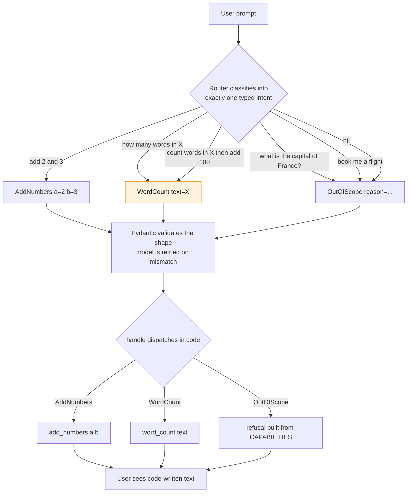
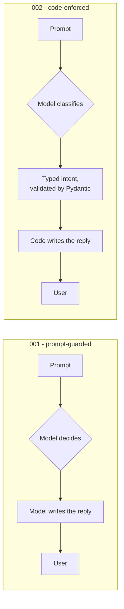

# 002 - Mapping Intent, Enforced

> Last updated: 2026-08-29 | Verified against: pydantic-ai 2.35.0, Python 3.14.3
> Difficulty: Beginner | Estimated time: 15 minutes

The sequel to [`../001-mapping-intent`](../001-mapping-intent), which asks the model in its system
prompt to refuse out-of-scope requests. That version demonstrated two failures, both reproduced with
real runs:

- `what is the capital of France?` matched no tool and was **answered anyway**
- when it did refuse, it listed capabilities it does not have (flashcards, study plans, quizzes)

This version fixes both by moving the decision's *consequences* into code. The model no longer
writes the answer. It only classifies.

**The idea in one line:** shrink what the model is allowed to *return*, rather than instructing it
more firmly.

---

## How it works

The model must return exactly one of three validated shapes:

```python
class AddNumbers(BaseModel):
    kind: Literal["add_numbers"]
    a: int
    b: int

class WordCount(BaseModel):
    kind: Literal["word_count"]
    text: str

class OutOfScope(BaseModel):
    kind: Literal["out_of_scope"]
    reason: str

Intent = Union[AddNumbers, WordCount, OutOfScope]

router = Agent(MODEL, output_type=Intent, system_prompt="Classify ... return out_of_scope.")
```

Then plain Python decides what happens:

```python
def handle(prompt: str) -> str:
    intent = router.run_sync(prompt).output
    if isinstance(intent, AddNumbers):
        return f"{intent.a} + {intent.b} = {add_numbers(intent.a, intent.b)}"
    if isinstance(intent, WordCount):
        return f"{word_count(intent.text)} words"
    return refusal()
```

`output_type` makes the union an *output tool*. Pydantic validates the model's response against it
and retries the model automatically if the shape does not match, so `handle()` can never receive
anything but one of the three types.

---

## What `router` is

`router` is an ordinary `pydantic_ai.Agent`, the same class as `agent` in 001. The name is mine, not
a framework concept: there is no `Router` type in Pydantic AI. It is called that because of the job
it does, which is decide *where* a request goes rather than *what to say* about it.

```python
router = Agent(
    MODEL,
    output_type=Intent,
    system_prompt="Classify the user's request into exactly one intent. "
                  "If it is not addition or word counting, return out_of_scope.",
)
```

Two things make it a router rather than a chat agent, and both are visible in that call:

**1. `output_type=Intent` replaces free text with a schema.** Pydantic AI turns the union into an
*output tool*: the model is handed a JSON Schema and must produce a value matching it. Asking the
agent what it expects shows exactly what the model sees:

```python
router.output_json_schema()
# {'anyOf': [ {...AddNumbers...}, {...WordCount...}, {...OutOfScope...} ]}
```

Each variant carries its `kind` as a `const`, its fields as `required`, and **its class docstring as
the schema `description`**:

```text
AddNumbers  -> "The user wants two numbers added."
WordCount   -> "The user wants the words in a piece of text counted."
OutOfScope  -> "The request matches no supported intent."
```

Those docstrings are not documentation. They are how the model decides which variant a prompt
belongs to, exactly as tool docstrings do the routing in 001. If classification goes wrong, rewrite
them before you touch anything else.

**2. It has no tools at all.** In 001, `add_numbers` and `word_count` are registered with
`@agent.tool_plain`, so the model calls them. Here they are plain functions the model has never
heard of, invoked by `handle()` after classification. Confirmed on the live object:

```python
isinstance(router, Agent)   # True, it is just an Agent
# function tools registered: NONE
```

So `router` is the one and only place the model appears in this program. Everything after
`router.run_sync(prompt).output` is ordinary Python:

```python
intent = router.run_sync(prompt).output   # <- the model's entire contribution
```

That single line is the whole reason the guard holds. The model's influence ends when it returns a
validated object, and `handle()` takes over from there.

---

## How a request flows

The model's only job is to pick one of three shapes. Validation happens before any code runs, and
every string the user reads is written by a handler, never by the model.



Three prompts collapse onto `OutOfScope` and are refused identically, which is the enforcement
working. The amber node is the known weakness: the compound prompt and the plain word-count prompt
both become a single `WordCount`, so the "add 100" half is dropped without an error. See
[Compound requests collapse](#compound-requests-collapse).

---

## How this differs from 001

The two folders answer the same prompts with the same two capabilities. The difference is **where
the final text comes from**.



In 001 the model is the author and the guard is a request in the system prompt, so it holds only
when the model agrees. In 002 the model is a classifier whose output is a schema, and the author is
`handle()`, so the guard cannot be talked out of.

| | 001 | 002 |
| --- | --- | --- |
| Model's job | decide **and** write the answer | classify only |
| Model's output surface | any string | one of three schemas |
| Who writes what the user reads | the model | `handle()` and `refusal()` |
| Scope guard lives in | the system prompt | the type union and the dispatch |
| Guard can be ignored | yes, and it was, on the France prompt | no, there is no other branch |
| Capability list | model recalls it, and invents entries | built from `CAPABILITIES` in code |
| Tools | registered with `@agent.tool_plain` | plain functions, no registration |
| Wrong output shape | not a concept, prose is prose | Pydantic rejects it and retries the model |
| Multi-step chaining | yes, one tool feeds the next | no, single intent per prompt |
| Small talk | handled conversationally | refused |
| Interface | chat UI at `web.py` | CLI at `main.py` |

**What did not change:** the model still decides which intent a prompt belongs to, so a
misclassification is still possible in both. Enforcement did not make the judgment reliable. It made
the *consequences* of that judgment bounded, which is the only part code can own.

---

## Files

| File | Purpose |
| --- | --- |
| `agent.py` | The intent types, the router, and the code-owned handlers. |
| `main.py` | CLI runner. No arguments replays the samples below; pass a prompt to try your own. |
| `.env` | Holds `OPENAI_API_KEY`. Git-ignored. |

There is deliberately **no `web.py`** here. An enforced router is a classifier plus a dispatcher,
not a chat agent, so a chat UI would misrepresent it. See [Which one to use](#which-one-to-use).

---

## Setup and running

```bash
pip install "pydantic-ai" "python-dotenv"
python main.py
python main.py "add 40 and 2"
```

Verified with `pydantic-ai==2.35.0`, `python-dotenv==1.2.2` on Python 3.14.3. Without an
`OPENAI_API_KEY` in `.env`, it falls back to `TestModel` and runs offline for free.

---

## Real results

Produced by running `python main.py` against `openai:gpt-5`.

| Prompt | Intent returned | Reply |
| --- | --- | --- |
| `add 2 and 3` | `AddNumbers{a:2, b:3}` | `2 + 3 = 5` |
| `how many words are in 'the quick brown fox jumps'?` | `WordCount{text:"the quick brown fox jumps"}` | `5 words` |
| `what is the capital of France?` | `OutOfScope` | `Sorry, I can't do that. I can: add two numbers together; count the words in a text.` |
| `book me a flight to Cairo next Tuesday` | `OutOfScope` | same refusal |
| `hi!` | `OutOfScope` | same refusal |

The `reason` field is populated but never shown to the user. It exists for logging:

```text
OutOfScope {'kind': 'out_of_scope', 'reason': 'Question about the capital of France; not addition or word counting.'}
```

Compare the third row with 001, where the same prompt returned `Paris. Great question!`. The guard
now holds because refusing is no longer something the model is asked to remember to do; it is the
only path `handle()` has left when the intent is not one of the two supported ones.

---

## What is actually enforced

The model still picks the variant, so a misclassification is still possible. What became
deterministic:

| Guarantee | Why it holds |
| --- | --- |
| Nothing runs without a valid typed intent | Pydantic validates the shape and retries the model on mismatch |
| The refusal wording is fixed | `refusal()` writes it; the model never sees or produces it |
| The capability list cannot drift | Built from `CAPABILITIES`, alongside the handlers it describes |
| No capability can be invented | The model has no channel to emit prose at all |

That last row is the structural fix. In 001 the model could say anything, so it did. Here its entire
output surface is three schemas, and none of them has a free-text field the user ever reads.

---

## The costs, honestly

### Small talk is refused

`hi!` returns the refusal. There is no conversational path left, because there is no intent for one.
Add a `SmallTalk` variant with a code-owned greeting if you want it back. Do not solve it by letting
the model write prose again; that reopens the exact hole this folder closes.

### Compound requests collapse

This prompt worked in 001, chaining two tools:

```text
count the words in 'I am learning pydantic ai' and then add 100 to that count
```

001 answered `Word count: 5` then `5 + 100 = 105`. **002 answers `5 words`.** It classified the
request as `WordCount` and silently dropped the addition.

This is the real limit of single-intent classification: one prompt maps to one intent, so a request
containing two cannot be represented. Nothing errors, which makes it worse than a failure that
announces itself. Options if you need it:

- Make the output `list[Intent]` so several intents can come back from one prompt
- Add an explicit `Compound` variant holding a list of steps
- Use [Option 3 from the discussion](../001-mapping-intent/README.md): route first, then hand
  in-scope prompts to the full agent so it keeps its loop and chaining

### Two capabilities to maintain, not one

`CAPABILITIES` is a hand-written list sitting next to the handlers. It cannot drift the way the
model's invented list did, but it can still go stale if you add a handler and forget the entry.
Deriving it from the intent classes is the tidier version once there are more than a few.

---

## Testing

### Offline, free, no API key

```python
from pydantic_ai.models.test import TestModel
import agent as m

with m.router.override(model=TestModel()):
    out = m.router.run_sync("add 2 and 3").output
# AddNumbers {'kind': 'add_numbers', 'a': 0, 'b': 0}   -> reply "0 + 0 = 0"
```

`TestModel` fills the first union member with placeholder values. Useful for proving the schema and
dispatch wire up; useless for judging classification. As in 001, use `router.override(...)` rather
than unsetting `OPENAI_API_KEY`, since `load_dotenv()` puts the key straight back at import time.

### Handlers on their own

The whole point is that these are ordinary functions:

```python
from agent import add_numbers, word_count, refusal

assert add_numbers(2, 3) == 5
assert word_count("a b c") == 3
assert "add two numbers together" in refusal()
```

Note what this buys you: the refusal text is now unit-testable. In 001 it was model output, so
there was nothing stable to assert against.

### Classification against the real model

Assert on the intent **type**, never the prose:

```python
from agent import router, OutOfScope

assert isinstance(router.run_sync("book me a flight").output, OutOfScope)
```

---

## Which one to use

The mechanics are compared in [How this differs from 001](#how-this-differs-from-001). The choice
itself reduces to one question: what does a wrong answer actually cost?

| If a mistake means... | Use |
| --- | --- |
| someone reads an inaccurate sentence | **001**, and keep the conversation and chaining |
| something *happens*: money moves, a message sends, a record changes | **002**, and accept the narrower surface |

The cost of 002 is real, not theoretical: you give up small talk and multi-step requests. Do not pay
it for a system where the worst case is an unhelpful reply.

For both at once, use the hybrid: classify first, refuse out-of-scope in code, and pass everything
else to the full 001-style agent. Two model calls per turn, enforcement plus conversation.

---

## Things to try next

1. Add a `SmallTalk` intent with a code-owned greeting and see `hi!` come back to life.
2. Change `output_type` to `list[Intent]` and retry the compound prompt. Does the chaining return?
3. Delete the `Literal["..."]` discriminators and observe how validation degrades.
4. Log every `OutOfScope.reason` for a day. It is a free list of the features users expected.
