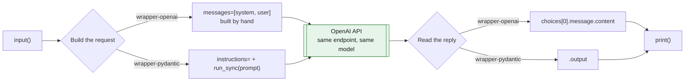

# 003 - OpenAI Wrapper

> Last updated: 2026-08-29 | Verified against: openai 3.3.1, pydantic-ai 2.35.0, Python 3.14.3
> Difficulty: Beginner | Estimated time: 10 minutes

The smallest useful program that talks to a model: read one line from the user, send it, print what
comes back. No tools, no routing, no structured output, no state.

It is written twice. `wrapper-openai.py` calls the OpenAI API directly. `wrapper-pydantic.py` does
the identical thing through Pydantic AI. Same prompt, same model, same three steps. Reading them
side by side answers the question 001 and 002 quietly skip: **what is the framework actually doing
for you?**

**What it demonstrates**

- The three steps every LLM program has underneath: build a request, send it, read one field out.
- What the OpenAI API really takes and returns: a `messages` list in, `choices[0].message.content`
  out. Every agent framework is a wrapper around this call.
- What Pydantic AI hides, and what it hands back in exchange: one result object, a message
  transcript, and a cost in dollars.
- That the reply text is a *small part* of what you pay for. A one-sentence answer spent more
  tokens thinking than speaking.
- What `instructions` compiles down to: the `system` role entry the raw file writes by hand.

---

## Files

| File | Purpose |
| --- | --- |
| `wrapper-openai.py` | The direct API call. The layer everything else sits on. |
| `wrapper-pydantic.py` | The same call through `Agent`. |
| `.env` | Holds `OPENAI_API_KEY`. Git-ignored, never committed. |
| `.env-sample` | Committed template. Copy to `.env` and set your key. |

There is no `main.py` and no shared module. Each file is standalone and runnable on its own, because
the whole point is to read one against the other.

---

## Setup

Both files need a real API key. Install the three packages, then create your `.env`:

```powershell
cd W:\ITV\lrn\knowledge-base\ai\foundation\agentic-ai\hands-on\001-pydantic-ai\003-openai-wrapper

pip install openai pydantic-ai python-dotenv

copy .env-sample .env
notepad .env                 # replace "Your API KEY" with your real key
```

`.env` is git-ignored, so your key never leaves this machine. Leave the value as the placeholder text
and the run fails with an auth error: the placeholder is a non-empty string, so the code treats it as
a real key.

Unlike [001](../001-mapping-intent/) and [002](../002-mapping-intent-enforced/), there is no offline
fallback here. Those exercises drop to `TestModel` when no key is set; this one is about having no
`if`. See [Getting the offline path back](#getting-the-offline-path-back) if you want it.

## How to run

Each file asks one question, prints one answer, and exits. Run them one after the other and compare:

```powershell
python wrapper-openai.py
python wrapper-pydantic.py
```

Each waits for you to type:

```text
You: In one sentence, what is an API?
AI : An API (Application Programming Interface) is a standardized way for one piece of software to
     request and use data or functionality from another through defined rules and endpoints.
```

### Without typing anything

To pass the question in and skip the prompt, pipe it in. Same question to both, so you can put the
two answers side by side:

```powershell
"In one sentence, what is an API?" | python wrapper-openai.py
"In one sentence, what is an API?" | python wrapper-pydantic.py
```

On bash or Git Bash:

```bash
echo "In one sentence, what is an API?" | python wrapper-openai.py
echo "In one sentence, what is an API?" | python wrapper-pydantic.py
```

### See the numbers behind the answer

Neither file prints token counts. To see what the call actually cost, run this from the same folder:

```powershell
python -c "import importlib.util as u; s=u.spec_from_file_location('m','wrapper-pydantic.py'); m=u.module_from_spec(s); s.loader.exec_module(m); r=m.agent.run_sync('In one sentence, what is an API?'); print(r.output); print(r.usage)"
```

It prints the reply followed by the real usage line, including the reasoning tokens discussed in
[The token surprise](#the-token-surprise):

```text
RunUsage(cost=Decimal('0.00143125'), details={'reasoning_tokens': 64}, input_tokens=41, output_reasoning_tokens=64, output_tokens=138, requests=1)
```

---

## The same job, twice

Both files have the same shape. The difference is entirely in the middle.

Both give the model the same persona, so the comparison is like for like:

```python
INSTRUCTIONS = (
    "You are a concise assistant for a beginner learning to call LLM APIs. "
    "Answer in at most two sentences."
)
```

**`wrapper-openai.py`** builds the request by hand and digs the answer out by hand:

```python
client = OpenAI(api_key=os.environ["OPENAI_API_KEY"])

def ask(prompt: str) -> str:
    response = client.chat.completions.create(
        model="gpt-5",
        messages=[                                             # <- you build this
            {"role": "system", "content": INSTRUCTIONS},
            {"role": "user",   "content": prompt},
        ],
    )
    return response.choices[0].message.content                 # <- you dig this out
```

**`wrapper-pydantic.py`** does neither:

```python
agent = Agent("openai:gpt-5", instructions=INSTRUCTIONS)

def ask(prompt: str) -> str:
    return agent.run_sync(prompt).output
```

Three things to notice in the raw version, because they are the three things the framework absorbs:

1. **`messages` is a list, not a string.** Even for one message you build a list of role/content
   dicts. That list is the conversation, and it is why multi-turn chat is "append and resend"
   (Section 4 of [`002-pydantic-ai-basics.md`](../../../002-pydantic-ai-basics.md)).
2. **`choices` is a list too.** The API can return several candidate replies; you almost always want
   `[0]`. The index is not optional and it is easy to forget why it is there.
3. **The key is passed explicitly.** `OpenAI()` reads `OPENAI_API_KEY` from the environment on its
   own, but writing it out shows where the credential enters the program.

### The difference, in one table

Everything below this table is detail on one of these rows.

| | `wrapper-openai.py` | `wrapper-pydantic.py` |
| --- | --- | --- |
| **Import** | `from openai import OpenAI` | `from pydantic_ai import Agent` |
| **Model named as** | `"gpt-5"` | `"openai:gpt-5"`, provider included |
| **Persona set by** | a `{"role": "system"}` entry you add to the list | `instructions=` on the agent |
| **You build** | the `messages` list, by hand, every call | nothing |
| **You read** | `.choices[0].message.content` | `.output` |
| **Returns** | `ChatCompletion`, OpenAI's own schema | `AgentRunResult`, the same for every provider |
| **Cost in money** | not provided, you price the tokens yourself | `.usage.cost`, a `Decimal` |
| **Transcript** | only the list you built | `.all_messages()`, normalised |
| **Change provider** | rewrite the client and the parsing | change the model string |
| **Offline / free testing** | none, it talks to OpenAI | `TestModel`, no key needed |
| **Tools, retries, validation** | you write them | built in, see 001 and 002 |
| **Lines that do the work** | 6 | 2 |
| **Hides from you** | nothing | the request and response shapes |

Read the last two rows together, because they are the same fact twice. The framework is shorter
*because* it hides things. That is worth paying for once you want tools or a provider swap, and it is
worth refusing while you are still learning what the call actually looks like.

**What is identical:** the endpoint, the model, the request on the wire, and the reply. Measured on
the same question, both send **41 input tokens**. Pydantic AI is a convenience on your side of the
wire, not a different service.

---

## `instructions` is a system message

`Agent(..., instructions=...)` looks like a framework concept. It is not. It becomes the exact
`{"role": "system", ...}` entry that `wrapper-openai.py` writes out by hand. Same wire, same three
roles (Section 4 of [`002-pydantic-ai-basics.md`](../../../002-pydantic-ai-basics.md)):

```python
# wrapper-openai.py, explicit
messages=[{"role": "system", "content": INSTRUCTIONS},
          {"role": "user",   "content": prompt}]

# wrapper-pydantic.py, the same request
Agent(MODEL, instructions=INSTRUCTIONS)
```

Run both and the two-sentence limit is obeyed either way. The model cannot tell them apart.

### Where `instructions` and `system_prompt` differ

Pydantic AI has two keywords for this, and section 5.1 of the tutorial explains why. You can watch
the difference on a live run by inspecting the request the agent built:

```python
Agent(MODEL, instructions=TEXT).run_sync("Hi").all_messages()[0]
#   .parts        -> [UserPromptPart]                    <- the text is NOT a part
#   .instructions -> "You are a concise assistant..."     <- it rides on the request

Agent(MODEL, system_prompt=TEXT).run_sync("Hi").all_messages()[0]
#   .parts        -> [SystemPromptPart, UserPromptPart]  <- the text IS a part
#   .instructions -> None
```

That is the whole distinction, made concrete. Because `system_prompt` becomes a **part**, it is
stored in the message history and gets replayed if you pass that history to a later run, even after
you have edited the agent. `instructions` is not stored, so every run takes it fresh from the
current agent definition.

Neither matters in this exercise, which is one turn with no history. It starts mattering the moment
you keep a conversation, which is why `instructions` is the one to reach for by default.

---

## How a request flows

Both paths converge on the same HTTP call to the same endpoint. The model cannot tell which file
sent the request.



The green node is the point: the framework is a convenience on your side of the wire, not a
different service.

---

## The two result objects, field by field

The comparison table above says the return types differ. Here is what that costs you in practice.
Both objects carry the same information; only the paths differ. Verified live on 2.35.0:

```python
# ChatCompletion, from wrapper-openai.py
response.choices[0].message.content                          # the text
response.choices[0].finish_reason                            # 'stop'
response.usage.prompt_tokens                                 # 41
response.usage.completion_tokens                             # 168
response.usage.completion_tokens_details.reasoning_tokens    # 128

# AgentRunResult, from wrapper-pydantic.py
result.output                                                # the text
result.usage.input_tokens                                    # 41
result.usage.output_tokens                                   # 174
result.usage.output_reasoning_tokens                         # 128
result.usage.cost                                            # Decimal('0.0017...')
result.all_messages()                                        # [ModelRequest, ModelResponse]
```

Two things only one side has. `ChatCompletion` gives you `choices`, a list, because the API can
return several candidate replies; `AgentRunResult` assumes you wanted one. And only `AgentRunResult`
prices the run for you, in dollars, as a `Decimal`.

`ChatCompletion` is OpenAI's schema, so switching provider means rewriting the parsing.
`AgentRunResult` is the same object whatever model string you pass, which is what makes
`"openai:gpt-5"` swappable for `"anthropic:claude-sonnet-4-6"` on one line.

---

## Real results

Both files, the prompt `In one sentence, what is an API?`, against `gpt-5`:

| | Reply | Input | Output | of which reasoning |
| --- | --- | --- | --- | --- |
| `wrapper-openai.py` | "An API is a standardized way for one piece of software to request and use data or functionality from another through defined rules and endpoints." | **41** | 168 | 128 |
| `wrapper-pydantic.py` | "An API is a set of rules and tools that let one piece of software request and use data or functions from another." | **41** | 174 | 128 |

**The input counts are identical, and that is the proof.** 41 tokens in both cases: the same persona,
the same question, the same request on the wire. Without `INSTRUCTIONS` the same question was 15
tokens; the persona costs 26 tokens on *every* call, forever.

The wording and the output counts differ between the two rows because generation is
non-deterministic, not because the paths disagree. Do not read a cost comparison into that column.

### The token surprise

Look at the completion counts against the length of the answer. One sentence came back, but:

```text
wrapper-openai.py    168 output tokens, of which 128 were reasoning
wrapper-pydantic.py  174 output tokens, of which 128 were reasoning
```

**Roughly three quarters of what you paid for was never shown to you.** `gpt-5` is a reasoning
model: it thinks in tokens before it answers, those tokens are billed, and they are not in the
reply. The visible sentence is around 30 tokens. The invoice says 168.

Both libraries expose it, in different places:

```python
response.usage.completion_tokens_details.reasoning_tokens   # raw SDK
result.usage.output_reasoning_tokens                        # Pydantic AI
```

This is the single most common surprise on a first bill, and neither wrapper hides it. Print it
whenever you are estimating cost.

---

## Which to use

| If you are... | Use |
| --- | --- |
| learning what an LLM call *is*, or debugging at the wire | the raw SDK, where nothing is hidden |
| pinned to OpenAI forever and want no extra dependency | the raw SDK |
| building anything with tools, structured output, or retries | Pydantic AI, and see 001 and 002 |
| likely to change model or provider later | Pydantic AI, for the one-line swap |

For a program this small the raw SDK is not worse. It is nine lines and no abstraction. The
framework starts paying for itself at exactly the point 001 begins: when the model needs to *call
something* rather than just talk.

### Getting the offline path back

001 and 002 run free with no key. To do the same here, add the branch this exercise deliberately
omits, in `wrapper-pydantic.py` only:

```python
if os.getenv("OPENAI_API_KEY"):
    MODEL = "openai:gpt-5"
else:
    from pydantic_ai.models.test import TestModel
    MODEL = TestModel()
```

There is no equivalent for `wrapper-openai.py`. The OpenAI SDK talks to OpenAI; a fake model is a
thing frameworks provide, and that is itself a reason to use one.

---

## Things to try next

1. Print the whole `response` object in `wrapper-openai.py`, then `result.all_messages()` in the
   other. Compare what each considers worth keeping.
2. Change `INSTRUCTIONS` in one file only, then run both. The persona diverges, which is the
   cheapest proof that the two files really are sending the same thing when it matches.
3. Wrap either `ask()` in a `while True:` loop. It will answer each turn with no memory of the
   last, because nothing appends to `messages`. That gap is what conversation history is.
4. Swap `instructions=` for `system_prompt=` in `wrapper-pydantic.py`, print
   `all_messages()[0].parts`, and watch a `SystemPromptPart` appear.
5. Change `"openai:gpt-5"` to another provider string in `wrapper-pydantic.py` and run it. Then
   try to do the same to `wrapper-openai.py`.
