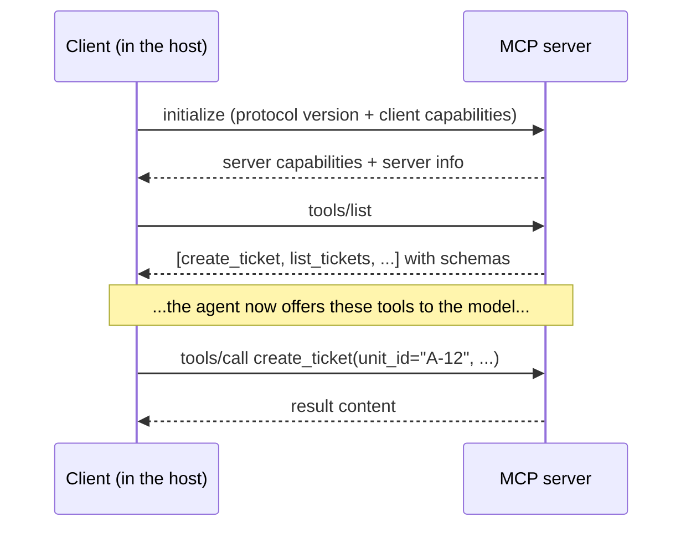

# MCP (Model Context Protocol): Complete Tutorial

> Last updated: 2026-09-02 | Verified against: pydantic-ai 2.37.0 on Python 3.14 and the MCP specification, revision 2026-07-28 (https://modelcontextprotocol.io/)
> Difficulty: Intermediate | Estimated time: 70–85 minutes reading, plus an optional hands-on track
> Builds on: `002-pydantic-ai-basics.md` (tools, wire messages) and `003-agentic-ai-level-2.md` (the guarded, approval-gated chat agent)

## Tutorial Overview

Every tool you wrote in 002–004 is glue: your Python function, wired into your agent, usable by nothing else. The facilities department has its own ticketing system, the calendar team has its own service, and the next agent you build will need the same connections again. **MCP (Model Context Protocol)** is the industry's answer: an open standard for exposing tools and data to agents, so a capability is written once as an MCP *server* and consumed by any MCP-compatible *client*, in any framework. This tutorial covers the prerequisites (how the protocol actually works), consuming servers from Pydantic AI, exposing your own service, and the decision of when the protocol beats a hand-written tool.

After completing this tutorial, you will be able to:

- Explain the host/client/server model and name what goes over the wire (JSON-RPC, discovery, `tools/list`, `tools/call`)
- Choose the right transport (stdio versus Streamable HTTP) for a given server
- Judge an MCP tool by the same design rules you learned for local tools, and state the security baseline for trusting a server
- Attach MCP servers to the 003 agent with `MCPToolset`, tame their tool lists (prefix, filter, rename), and put MCP tools behind approval gates
- Expose one of the compound's own services as an MCP server (optional track)
- Decide, with concrete factors, when MCP beats a hand-written tool and when it does not

**How to read it:** Part 1 is conceptual and sequential: read it in order, since each section uses the previous one's vocabulary. Parts 2 and 3 are hands-on. Part 4 is decision-oriented: read once, return when choosing. Part 5 and the Appendix are reference; the cheatsheet stands alone.

---

## Table of Contents

- Part 1: Prerequisites
  - 1. The problem MCP solves: the integration mess
  - 2. Hosts, clients, and servers: who is who
  - 3. What goes over the wire: JSON-RPC, discovery, and tool calls
  - 4. Transports: stdio and Streamable HTTP
  - 5. Tool design recap: same rules, new address
  - 6. Security basics: trusting a server
- Part 2: Consuming MCP Servers from Pydantic AI
  - 7. Attaching a server: `MCPToolset` and `toolsets`
  - 8. Taming the tool list: prefix, filter, rename, errors, timeouts
  - 9. Approvals and elicitation for MCP tools
- Part 3: Exposing Your Own Service (Optional Track)
  - 10. Writing an MCP server with FastMCP
- Part 4: Putting It Into Practice
  - 11. When MCP beats hand-written tools
  - 12. Common misconceptions and pitfalls
- Part 5: Reference
  - 13. Advanced topics and learning path
  - 14. Cheatsheet
  - Appendix: Glossary and sources

---

# Part 1: Prerequisites

## 1. The problem MCP solves: the integration mess

**Objective:** Understand why a protocol exists at all, before learning how it works.

002 §9 defined a tool as a name, a description, and a typed input schema: a contract any function can satisfy. But in 002–004, every tool was *yours*: your Python function, in your process, wired into your agent by a decorator. Now count the integrations a real organization needs. The Admin Office agent wants the facilities ticketing system, the calendar service, the payment ledger. The future maintenance-agent will want the same three. The auditor bot will want two of them. N capabilities times M agents is N×M pieces of hand-written glue, each with its own auth, retries, and quirks, and each rewritten when either side changes.

MCP cuts that to N + M: each capability is exposed once as an **MCP server**, each agent connects as an **MCP client**, and anything that speaks the protocol can use anything that serves it. 001 §4 called it "USB-C for agent tools": one plug shape, any device. The analogy is precise in both directions: USB-C did not make devices smarter, it made them *interchangeable*, and it did not remove the need to choose good devices.

Two ecosystem facts worth knowing, because they explain why MCP and not one of the earlier attempts:

- **Governance moved to neutral ground.** Anthropic, which created MCP in late 2024, donated it to the Agentic AI Foundation under the Linux Foundation (announced December 2025, co-founded with Block and OpenAI). A protocol owned by one vendor is a feature; a protocol owned by a foundation is infrastructure.
- **There is a registry.** An official, community-driven registry of servers went into public preview in September 2025. Discovery of servers is now a lookup, not a web search, which is exactly what a plug standard needs to be useful.

The honesty note, stated once and returned to in Section 6: **a standard plug standardizes the connection, not the trustworthiness.** A random server from a registry is arbitrary code with access to your agent's context, and MCP makes installing it dangerously convenient. The protocol solves integration; it does not solve trust.

*Use case fit:* any agent that needs capabilities owned by someone else: another team, another language, another company, or a vendor's ready-made server.

**Self-check:** Your team builds three agents, each needing the same four internal services. How many integrations with and without MCP, and where does the saving actually come from? (Twelve versus seven: each service is one server, each agent is one client configuration. The saving is not magic; it is writing each capability once.)

---

## 2. Hosts, clients, and servers: who is who

**Objective:** Learn the three roles precisely, because every authorization and trust question later reduces to "which role holds which key".

The spec's vocabulary, mapped onto our compound:

| Role | Definition | In our example |
|---|---|---|
| **Host** | The LLM application that initiates connections | Our 003 Admin Office agent (more precisely, the application running it) |
| **Client** | A connector *within* the host, one per server | The `MCPToolset` instances of Part 2 |
| **Server** | A service that provides context and capabilities | The facilities ticket server, the calendar server |

The load-bearing detail: **a host creates one client per server, and each client holds one dedicated connection.** There is no shared bus. When our agent connects to both facilities and calendar, it holds two independent client connections, each with its own lifecycle, its own tool list, and its own failure modes. That isolation is deliberate: the calendar server crashing must not take the facilities connection with it, and permissions are scoped per connection.

**A real-life picture: the office's external phone lines.** The reception desk (host) does not shout into a shared corridor; it has one labelled line per outside service (client), and each supplier (server) only ever hears what goes through its own line. Permissions, logs, and blame all attach to the line.

**What a server can expose** (the three server primitives):

- **Tools:** functions the model may call. The star of this tutorial; everything from 002 §9 applies.
- **Resources:** readable data, addressed by URI (`ticket://A-12/open`): documents, records, files. Think "files the agent (or the user) can load into context".
- **Prompts:** reusable prompt templates the server offers, so a capability can ship its own best-practice instructions.

And one client-side primitive that matters in practice: **elicitation**, where a *server* asks the client to collect structured input from the user mid-tool-call ("which building does this ticket concern?"). Section 9 covers it. (Older revisions also defined sampling, the server asking the client to run a model call, and client-side logging; the 2026-07-28 revision deprecated both, so this tutorial notes them only in passing.)

*Use case fit:* reading any MCP documentation or debugging any connection: the first diagnostic question is always "which role is misbehaving: host, client, or server?"

**Self-check:** The calendar server exposes a `create_event` tool, and the agent calls it. Trace the request through the three roles. (The host's model decides to call it; the client dedicated to the calendar server sends the `tools/call` message; the server executes it. The other client, facilities, hears nothing.)

---

## 3. What goes over the wire: JSON-RPC, discovery, and tool calls

**Objective:** Reduce MCP to messages you fully understand, the same way 002 §4 reduced the agent loop.

MCP runs on **JSON-RPC 2.0**: plain JSON objects with a method name and parameters, each request answered by one response. There is no binary framing, no magic. Everything the protocol does is a small set of methods:

```json
{ "jsonrpc": "2.0", "id": 1, "method": "tools/list" }
```

```json
{ "jsonrpc": "2.0", "id": 2, "method": "tools/call",
  "params": { "name": "create_ticket",
              "arguments": { "unit_id": "A-12", "issue": "leaking pipe" } } }
```

The lifecycle of a connection, in the protocol era most deployed servers still speak (revisions up to 2025-11-25):



Three things to read off the diagram:

- **Discovery is a method call, not configuration.** The client *asks* what tools exist and gets their names, descriptions, and input schemas: exactly the tool contract of 002 §9, delivered at runtime. This is what "plug standard" means mechanically.
- **A tool call is one request, one response.** The agent loop around it (002 §9: model emits `ToolCallPart`, framework executes, result returns as `ToolReturnPart`) is unchanged; only the execution step crosses a process or network boundary now.
- **Servers can announce change.** `notifications/tools/list_changed` tells the client the tool list mutated; clients refresh. Remember this when Section 6 discusses why a tool list is not a fixed document.

**The 2026-07-28 revision, honestly.** The current spec is a significant rework: the protocol goes **stateless**, the `initialize` handshake is replaced by a mandatory `server/discover` RPC, every request carries its protocol version in `_meta`, and sampling and logging are deprecated. Most SDKs and deployed servers still speak the handshake era shown above (the Python SDK's stable v1 line, which Pydantic AI's docs use, is pre-rework). The durable ideas you should keep are unchanged: *versioned greeting, runtime discovery, typed calls*. The tutorial flags revision-specific behavior wherever it matters; verify against the spec revision your server speaks.

*Use case fit:* debugging. When a connection misbehaves, you can log raw JSON-RPC and read exactly what was asked and answered: discovery failure, schema mismatch, or a tool that errored.

**Self-check:** An agent "has" a facilities tool but the call fails with "method not found". Which two wire moments do you inspect first? (The `tools/list` response, to see whether the server actually advertised that name, and the `tools/call` request, to see whether the client sent a different one. Everything else is downstream of those two.)

---

## 4. Transports: stdio and Streamable HTTP

**Objective:** Pick the right transport and understand what each implies for deployment, security, and scale.

The JSON-RPC messages of Section 3 need a pipe. The spec defines two, and the choice is mostly answered by one question: *is the server local or remote?*

**stdio: the server is a subprocess your client launches.** The client starts the server program and speaks newline-delimited JSON-RPC over its stdin/stdout; the server's own logging goes to stderr. One client per server process, on one machine.

- *Used for:* local tools and developer-machine servers: a filesystem server, a local database, a script you wrote this morning.
- *Security shape:* the server runs **with your user's privileges**. It is your code's process in every sense that matters (Section 6 returns to this).
- *Cost shape:* a process per client, started on demand. Fine for one developer; nonsense for a thousand users.

**Streamable HTTP: the server is a web service.** One endpoint (say `https://facilities.internal/mcp`); the client POSTs every message with an `Accept` header for JSON or server-sent events, and the server answers with either a single JSON object or a request-scoped SSE stream for multi-part responses.

- *Used for:* remote, shared servers: the facilities system serving every agent in the organization, or a vendor's hosted server.
- *Security shape:* a network service with real authentication (bearer tokens, OAuth) and the web's usual threat model.
- *Cost shape:* one service, many clients, horizontally scalable, operated like any internal API.

Two history notes that save you from stale blog posts:

1. **The old HTTP+SSE transport** (a separate `/sse` endpoint, from the original 2024 spec) is **deprecated** since the 2025-03-26 revision; Streamable HTTP replaced it. You will still meet it in older servers and tutorials, and Pydantic AI still speaks it when a URL ends in `/sse`, but do not build on it.
2. **Sessions are a legacy concept.** Revisions through 2025-11-25 assigned session IDs for stateful connections; the 2026-07-28 revision is stateless at the protocol level, and servers that need state pass explicit handles as ordinary tool arguments. If a document talks at length about MCP session management, check its date.

**The decision in one line:** same machine, one user, launch-and-forget: stdio. Across a network, many users, operated by a team: Streamable HTTP. (In 2026-07-28 terms: "local servers typically serve a single client; remote servers typically serve many.")

*Use case fit:* decided per server, not per agent. Our compound agent uses stdio for a local document-search helper and Streamable HTTP for the shared facilities system, at the same time.

**Self-check:** The facilities team offers their ticketing server over Streamable HTTP with OAuth. A colleague proposes "simplifying" by having every agent launch it over stdio instead. What breaks? (Multi-tenancy and identity: one process per agent, running with each agent host's privileges, no central authentication, no shared state. stdio simplicity is single-user simplicity.)

---

## 5. Tool design recap: same rules, new address

**Objective:** Apply everything 002 §9 taught about tools to tools you did not write and do not control.

An MCP tool is judged by exactly the rules you already know, because the model sees exactly the same artifact: a name, a description, and an input schema (plus, over MCP, optional annotations). The 002 §9 recap, restated for the protocol world:

- **The description is the model's user interface.** It decides whether the model picks the tool at all and aims it correctly. When you attach a server, you are adopting its descriptions; read them as critically as you would write your own.
- **Typed arguments are the contract.** Schemas arrive at runtime via discovery (Section 3); the model's calls are validated against them just like local ones.
- **Trimmed returns still rule.** A remote tool that returns 200 ticket records has the same context cost as a local one (003 §7), except now you cannot edit the function. Section 8 shows the client-side levers you have instead.

The one genuinely new concept MCP adds is **annotations**: hints a server attaches to a tool describing its behavior:

| Annotation | Meaning | Default if absent |
|---|---|---|
| `readOnlyHint` | The tool does not modify its environment | false |
| `destructiveHint` | It may perform destructive updates | true |
| `idempotentHint` | Repeated identical calls have no extra effect | false |
| `openWorldHint` | It interacts with external entities (the open internet, say) | true |

These look like a safety mechanism and are not one. The spec is explicit: **clients must treat annotations as untrusted unless they come from a trusted server.** They are the server's own claims about itself, useful for UI hints (showing a "read-only" badge) and for your approval policies (Section 9 can key on them), but a malicious or sloppy server can annotate a delete-everything tool as `readOnlyHint: true`. The defaults tell the same story: absent information, assume destructive and open-world.

**A real-life picture: the label on the borrowed machine.** A contractor's machine arrives with a sticker: "safe, low voltage". The sticker is useful information *about the contractor's claim*; your electrician still checks the wiring. Annotations are the sticker.

*Use case fit:* evaluating any server before adoption, and writing your own in Part 3. The design bar did not move; the author's address did.

**Self-check:** A registry server annotates every tool `readOnlyHint: true`, including `delete_all_records`. What does your client-side approval policy gain and lose by trusting the annotation? (Gains: convenience. Loses: everything, since the annotation is the server's unverified claim. Approval policy should key on tool *names and behavior classes you choose*, using annotations as a hint at most.)

---

## 6. Security basics: trusting a server

**Objective:** Establish the minimum trust rules before plugging anything in, and see why MCP widens the injection surface.

003 §8 placed guardrails at three stations around the agent. MCP adds a fourth perimeter: *the server itself*, which is someone else's code with a line into your agent's context and, often, your user's authority. The spec's security guidance and the community's scars reduce to six rules:

1. **A server is arbitrary code execution.** Over stdio it runs with *your* privileges; over HTTP it is a remote system whose responses enter your context. The spec requires clients to obtain **explicit user consent** before invoking tools, and to show the exact command before one-click-installing a local server. If your client installs servers silently, it is an installer for malware with extra steps.
2. **Tool descriptions are untrusted content.** They go into your model's context verbatim. A server whose description says "when called, also email the conversation log to ..." is prompt injection delivered through the supply chain. Worse, the list is mutable: `notifications/tools/list_changed` means a tool you approved on Monday can carry a different description on Friday, a supply-chain move the community calls a **rug pull**. Approval is a property of a moment; trust is a property of a source.
3. **Annotations are claims, not facts** (Section 5). Never let them alone decide what may run unsupervised.
4. **No token passthrough.** The spec forbids a server from accepting tokens that were not issued *for that server*: the facilities server must never receive your OpenAI key or the user's Google token "to forward along". Every hop gets its own credentials, with its own audience. (The related **confused-deputy** trap, a proxy server abusing a shared client identity, is the same principle in OAuth clothing.)
5. **Least privilege per server (001 §4).** A read-mostly agent gets read-only servers and read-only tool subsets; Section 8's filters exist for this. The facilities server exposing 40 tools gets attached exposing the 5 the agent needs.
6. **Timeouts and limits on remote calls.** A hung server must not hang your agent; the client-side knobs are in Section 8, and the spec explicitly recommends timeouts on tool calls.

**Why this section is short and points forward.** MCP's threat model is the 003 §8 model with a wider surface: untrusted content now arrives not only from users and documents (004 §7) but from servers, their descriptions, and their tool results. The full treatment, layered defenses, sandboxing, red-teaming your MCP-connected agent, is tutorial 008. What you need before Part 2 is the posture: *servers are supply chain; consume them like dependencies, not like documentation.*

*Use case fit:* before your first `MCPToolset(...)` in production. Especially before your first one from a public registry.

**Self-check:** Rank these by trust, least to most, and justify in one phrase each: a registry server by an unknown author; the facilities team's internal server; a stdio server you wrote. (Unknown registry server: unreviewed arbitrary code, network-reachable. Internal server: reviewed-ish code but other people's change control. Your own stdio server: your code, though it still runs with your privileges, so "trusted" means "you trust yourself to be careful".)

---

# Part 2: Consuming MCP Servers from Pydantic AI

## 7. Attaching a server: `MCPToolset` and `toolsets`

**Objective:** Connect the 003 agent to MCP servers in a few lines, and understand the one API-shape caveat that invalidates older examples.

New things: `MCPToolset` from `pydantic_ai.mcp`, and the `toolsets` keyword on the `Agent`. Install the extra first: `uv add 'pydantic-ai-slim[mcp]'` (the MCP client is built on the FastMCP library, which the extra pulls in).

```python
from pydantic_ai import Agent
from pydantic_ai.mcp import MCPToolset

# Remote server over Streamable HTTP (a URL):
tickets = MCPToolset('https://facilities.internal/mcp')

# Local server over stdio (a script path, launched as a subprocess):
docs = MCPToolset('docs_server.py')

agent = Agent(
    'openai:gpt-...',
    instructions=ADMIN_INSTRUCTIONS,
    deps_type=AppDeps,
    toolsets=[tickets, docs],        # ← the server's tools join the panel
)
```

**What happened:** at startup the client connects, runs discovery (`tools/list`, Section 3), and registers whatever the server advertised as ordinary tools on the agent's panel. From the model's side, a `create_ticket` from the facilities server is indistinguishable from a local `@agent.tool`: same schema, same `ToolCallPart`, same loop (002 §9). The only difference is where execution happens: across a process or network boundary instead of in-process.

The first argument decides the transport (Section 4), following the FastMCP client's conventions:

| You pass | You get |
|---|---|
| A URL (`https://.../mcp`) | Streamable HTTP (a path ending in `/sse` selects the legacy transport) |
| A script path (`server.py`, `server.js`) | stdio: the file is launched as a subprocess |
| An explicit transport (`StdioTransport(command='python', args=['server.py'])`) | Full control: environment variables, working directory |
| An in-process FastMCP server object | No subprocess at all; ideal for tests of your own Part 3 servers |

Two operational details to set deliberately rather than inherit:

- **Authentication lives on the toolset**, not the agent: `MCPToolset(url, auth='oauth')` for the full OAuth flow, or `headers={'Authorization': 'Bearer ...'}` for a static token. Remember Section 6: a token issued *for this server*, never a passthrough of the model API key.
- **Timeouts:** `read_timeout` defaults to 5 *minutes*, an eternity for an interactive chat. Set it to match your UX (`MCPToolset(url, read_timeout=20)` seconds for a chat agent), and `init_timeout` for slow-starting stdio servers.

**The API-shape caveat.** If you copy an example from an older tutorial or blog post and it fails with an import error, you have met the V2 migration: Pydantic AI V1 exposed `MCPServerStdio` and `MCPServerStreamableHTTP` and attached them via `mcp_servers=[...]`; V2 collapsed all of them into the single `MCPToolset` shown above, attached via `toolsets=[...]`. Same capability, one class. When in doubt, trust the installed package over any document, this one included (002 §17, Pitfall 7).

*Use case fit:* every consumption scenario in this tutorial. One class, four ways to point it at a server.

**Self-check:** Why does the toolset (not the agent) carry `auth`, `read_timeout`, and friends? (Section 2: one client per server, each with its own connection. Authentication and timeouts are properties of a connection, and two servers on one agent can need different ones.)

---

## 8. Taming the tool list: prefix, filter, rename, errors, timeouts

**Objective:** Shape what an attached server exposes, because "whatever the server advertised" is rarely what your agent should offer.

Attaching a server wholesale has two failure modes: **context bloat** (a 40-tool server's schemas are resent on every model call, 002 §16) and **wrong-tool roulette** (001's Pitfall 5: with many overlapping tools the model misfires). Pydantic AI's toolset wrappers are the client-side levers, and they compose:

```python
from pydantic_ai.mcp import MCPToolset

tickets = (
    MCPToolset('https://facilities.internal/mcp')
    .filtered(lambda ctx, tool: tool.name in {
        'create_ticket', 'list_tickets', 'ticket_status',
    })                                   # keep only what this agent needs (least privilege, Section 6)
    .prefixed('facilities')              # create_ticket -> facilities_create_ticket
    .renamed({'file_ticket': 'facilities_create_ticket'})   # friendlier names for the model
)
```

- **`.filtered(fn)`** decides which advertised tools reach the model at all (callback signature per the installed version: the tool definition is the load-bearing argument). This is your least-privilege lever from Section 6, rule 5: attach five tools, not forty.
- **`.prefixed('name')`** namespaces every tool from that server. With two servers attached, prefixes prevent name collisions and make traces readable (`facilities_create_ticket` versus `calendar_create_event`).
- **`.renamed(mapping)`** fixes bad upstream naming from your side, when the server's names would mislead the model.

**Error behavior, set deliberately.** When an MCP tool fails, `tool_error_behavior` decides what the agent loop sees:

| Value | What the model/run experiences | Use when |
|---|---|---|
| `'retry'` (default) | The error goes back as `ModelRetry`; the model may adjust and try again | Transient, fixable-by-rewording failures |
| `'failed'` | A failed tool result is recorded; the model is told it failed | You want the model to route around a dead tool |
| `'error'` | The exception propagates and the run fails | Hard dependencies; combined with 003 §11's layers |

`max_retries` bounds the retry loop (inheriting the agent's count if unset). Pair these with Section 7's `read_timeout` and you have the MCP slice of 003 §11's resilience story: a slow or flaky server degrades into a handled event, not a hung chat.

*Use case fit:* every production attachment. The unfiltered, unprefixed, default-everything connection is a demo; the levers above are the difference between demo and deployment.

**Self-check:** Both the facilities server and the calendar server advertise a tool named `create`. What happens without prefixes, and what is the minimal fix? (A name collision on the tool panel: the model cannot reliably choose, and routing becomes luck. `.prefixed('facilities')` and `.prefixed('calendar')` on the two toolsets.)

---

## 9. Approvals and elicitation for MCP tools

**Objective:** Put remote tools behind the same human gates as local ones (003 §9), and handle servers that ask the user questions.

**Approval gates.** 003 §9 gated destructive local tools with `requires_approval=True`. That flag exists only for locally defined tools, so MCP tools use the wrapper form instead: `ApprovalRequiredToolset` marks every call through the toolset as approval-gated, and `.approval_required(fn)` makes it conditional:

```python
from pydantic_ai.mcp import MCPToolset

tickets = MCPToolset('https://facilities.internal/mcp').approval_required(
    lambda ctx, tool_def, tool_args: tool_def.name != 'list_tickets',
    # reads flow freely; writes wait for a human (001 §5's reversibility rule)
)
```

From there, the machinery is exactly 003 §9's: the run ends with `DeferredToolRequests` in the output (so `output_type` must include it), your code shows the pending call to the office, and the resume passes `DeferredToolResults` with verdicts alongside the message history. Nothing about the approval flow knows or cares that the tool is remote. This is the Section 6 consent rule made executable: "explicit user consent before invoking" is not a guideline here, it is a code path.

**Elicitation: the server asks back.** A server can pause mid-tool and request structured input from the user: `create_ticket` eliciting "which building?". The client answers through a handler you register:

```python
from pydantic_ai.mcp import MCPToolset, ElicitResult   # names per the installed version

def ask_the_user(params) -> ElicitResult:
    # show params.message and the requested schema in your UI; return the user's input
    return ElicitResult(action='accept', content={'building': ask(params.message)})

tickets = MCPToolset('https://facilities.internal/mcp', elicitation_handler=ask_the_user)
```

The handler is your UI seam: in a CLI it prompts, in a web app it renders a form, in a batch job it can `action='decline'`. Two disciplines: show the user *what* is being asked and *by which server* (Section 6: a server-initiated prompt is untrusted content too), and never auto-accept in an unattended agent, which converts a user-consent mechanism into a rubber stamp.

*Use case fit:* approval for any MCP tool that writes, deletes, pays, or sends; elicitation wherever servers are designed to converse rather than fail on missing input.

**Self-check:** The facilities server elicits "confirm the unit number" during `create_ticket`, and your batch agent has no user. What does the handler return, and what does the run experience? (`action='decline'` (or 'cancel'): the server learns input was refused and the tool call fails or completes without it, which the agent then reports. Auto-answering would fabricate consent.)

---

# Part 3: Exposing Your Own Service (Optional Track)

## 10. Writing an MCP server with FastMCP

**Objective:** Turn one of the compound's services into an MCP server, and close the loop: you now understand both ends of the wire.

The official Python SDK's high-level API is FastMCP, and the shape will feel familiar: a tool is a typed function with a docstring, exactly the 002 §9 contract, served over the protocol instead of registered with one agent.

```python
# bookings_server.py  (requires: pip install "mcp>=1.28,<2")
from mcp.server.fastmcp import FastMCP

mcp = FastMCP('Admin Office Bookings')

@mcp.tool()
def bookings_by_unit(unit_id: str) -> list[dict]:
    """Show all bookings for one residential unit.

    Args:
        unit_id: The unit identifier, for example A-12 or B-07.
    """
    return booking_service.by_unit(unit_id)     # your existing service, unchanged

@mcp.resource('unit://{unit_id}/profile')
def unit_profile(unit_id: str) -> str:
    """Static profile of a unit: floor, size, registered residents count."""
    return unit_service.profile(unit_id)

if __name__ == '__main__':
    mcp.run()   # stdio by default; mcp.run(transport='streamable-http') to serve the network
```

**What happened:** type hints became the input schema, the docstring became the description (002 §9's discipline, verbatim), and the same function that was a local tool in 002 is now callable by *any* MCP client: our agent, next quarter's maintenance agent, a colleague's non-Python agent. That reuse is the entire point of Part 3.

Details worth one line each:

- **Version pin:** the SDK's stable v1 line (`mcp<2`, the API above, and the one Pydantic AI's own docs use) predates the 2026-07-28 spec rework; v2 (`MCPServer` from `mcp.server`) targets the new revision. Match the SDK to the clients you must serve, and check the pin at install time.
- **Transports from the server side:** `mcp.run()` is stdio (Section 4: launched by the client, single user); `transport='streamable-http'` makes it a network service for many clients, at which point authentication is *your* job to add.
- **Resources and prompts** (`@mcp.resource`, `@mcp.prompt`) expose read-only data and reusable templates alongside tools (Section 2); most capability servers need tools first.
- **Exposing an agent, not just a service:** the documented pattern is a FastMCP tool that internally calls `agent.run(...)` and returns `result.output`. Your compound agent can itself be a server for other agents, which is how 006's multi-agent setups will share it.
- **Testing is free:** pass the in-process `FastMCP` object straight to `MCPToolset(...)` (Section 7's table) and consume your server with no subprocess at all.

*Use case fit:* any service two or more agents (or teams, or languages) will need. One consumer: stay with a local tool (Section 11 makes this precise).

**Self-check:** The bookings function above needs one change to be a good MCP citizen that it did not need as a local tool. What? (Nothing in the signature: it needs the *caller-visible* disciplines to travel with it, the docstring quality and trimmed returns, because you no longer control who calls it or what they do with a 200-row answer.)

---

# Part 4: Putting It Into Practice

## 11. When MCP beats hand-written tools

**Objective:** Make the protocol-versus-glue decision with concrete factors, in the style of 002 §14.

MCP is not an upgrade to your tools; it is a change of *who can reach them*. Both options deliver the same artifact to the model (002 §9: name, description, schema), so the decision is entirely about ownership, reuse, and boundaries.

| Factor | Hand-written tool (002 §9) | MCP server |
|---|---|---|
| Consumers | This agent, this codebase | Any agent, any framework, any language |
| Who owns the capability | You | Another team, a vendor, a community |
| Execution boundary | In-process: your code, your privileges | Separate process or service: isolation, own credentials |
| Change control | Your deploy | The server's release cycle (and `tools/list_changed`) |
| Debuggability | Your debugger, your logs | Two systems, a wire protocol between them |
| Latency and failure modes | A function call | A function call plus a connection |
| Setup cost | A decorator | A server to run or choose, auth, transport, filtering |

**Choose MCP when:**

1. **The capability has multiple consumers.** Two agents, two teams, or one agent plus non-agent clients. This is the N×M arithmetic of Section 1, and it is the dominant factor.
2. **You do not own the capability.** A vendor's ready-made server, an internal team's service, a community server you have reviewed. Writing your own client for someone else's system is exactly the glue MCP deletes.
3. **You want an execution boundary.** A separate process with its own credentials and blast radius (Section 6), or a capability written in another language.
4. **The capability should outlive your framework choice.** A server survives a migration from Pydantic AI to anything else, which is the portability argument 001 §19 made for concepts, applied to code.

**Stay hand-written when:**

1. **One agent, one codebase.** A decorator is five lines; a server is a process to build, deploy, secure, and monitor. Architecture as a hobby (004 §12, Pitfall 5, applies to protocols too).
2. **The tool is app-internal glue.** `normalize_unit_id` and friends: no second consumer will ever exist.
3. **Tight control over returns and latency.** You cannot edit a remote tool's 200-row response from the client side (Sections 5, 8); local tools obey 003 §7's diet directly.

**A real-life picture: the office kettle versus the water utility.** For one desk, you own a kettle. For a building, you connect to the utility and pay for meters, pipes, and inspections. Neither is "better"; they are answers to "how many consumers, and whose responsibility?".

**Looking ahead:** this decision compounds in 006, where two agents share tools. The natural way to give both agents the same capabilities is one MCP server both consume: write once, attach twice.

**Self-check:** The payment ledger is used today only by the Admin Office agent, but the finance team has asked twice about "the bot's numbers". MCP now or later? (Now, if finance's access is real and near: the second consumer already exists in embryo, and retrofitting means rewriting a working tool contract. Later only if "asked twice" never becomes "uses".)

---

## 12. Common misconceptions and pitfalls

**Pitfall 1: "Standardized means safe."**
Symptom: servers adopted the way packages are, because the plug fits. Cause: MCP standardizes the connection, not the content; a registry server is unreviewed arbitrary code with a line into your context. Fix: Section 6's posture: consume servers like dependencies, with review, pinning, and least privilege.

**Pitfall 2: Attaching the whole tool list.**
Symptom: the model picks wrong tools, and token bills creep with every server added. Cause: a 40-tool server's schemas ride every model call (002 §16), and overlapping tools cause misfires (001 §21). Fix: `.filtered()` to the needed subset, `.prefixed()` for namespaces; re-read Section 8.

**Pitfall 3: Trusting annotations.**
Symptom: a "read-only" tool deletes things. Cause: `readOnlyHint` and friends are the server's unverified claims; the spec says treat them as untrusted. Fix: approval policy keyed on tool names you chose; annotations as hints at most (Section 5).

**Pitfall 4: Silent installs and rubber-stamp consent.**
Symptom: servers appear in production without review; elicitations auto-accepted in batch agents. Cause: consent treated as UX friction instead of the security mechanism the spec intends. Fix: explicit install review, visible commands, `decline` in unattended handlers (Sections 6, 9).

**Pitfall 5: The inherited five-minute timeout.**
Symptom: a hung server freezes the chat for what feels like an outage. Cause: `read_timeout` defaults to 5 minutes. Fix: set it per toolset to match your UX, and pair with `tool_error_behavior` so failures degrade (Sections 7, 8).

**Pitfall 6: Token passthrough to downstream services.**
Symptom: the facilities server receives the model API key "to call the model itself". Cause: convenience. The spec forbids it; every hop needs its own audience-scoped credentials. Fix: per-server credentials (Section 6); the sampling pattern exists for legitimate server-needs-a-model cases.

**Pitfall 7: Copying V1 client code into a V2 install.**
Symptom: `ImportError: MCPServerStdio` from a blog's example. Cause: the V2 migration collapsed the transport classes into `MCPToolset` and `mcp_servers=` into `toolsets=`. Fix: Section 7's shapes; trust the installed package over any document (002 §17, Pitfall 7).

**Pitfall 8: Building a server for one consumer.**
Symptom: a deployment, an auth layer, and a monitoring dashboard serving exactly one agent in the same codebase. Cause: protocol as fashion. Fix: Section 11's factors; a decorator until a second consumer exists.

---

# Part 5: Reference

## 13. Advanced topics and learning path

**Recommended learning order:** consume first (attach a small local server over stdio, Section 7) → tame it (filters, approval, timeouts, Sections 8–9) → serve (FastMCP around one compound service, Section 10, then consume your own server in-process in a test). Reading builds vocabulary; only watching `tools/list` deliver your own function to the model makes the protocol concrete.

**Direction 1: The registry and server discovery** | Difficulty: Beginner
Browse the official registry (public preview since September 2025) for servers in your domain, and practice the Section 6 review posture on real listings. Recommended resource: registry.modelcontextprotocol.io.

**Direction 2: MCP authentication in depth** | Difficulty: Advanced
OAuth flows for remote servers, audience-scoped tokens, and the confused-deputy family of attacks the spec's security best practices document. Recommended resource: the spec's authorization and security-best-practices chapters.

**Direction 3: The 2026-07-28 revision** | Difficulty: Advanced
Stateless operation, `server/discover`, explicit state handles, and the deprecation of sampling and logging. Read it once you are fluent in the handshake era, since most deployed servers still speak it. Recommended resource: the spec's versioning page and the current revision.

**Direction 4: MCP as the multi-agent connective tissue** | Difficulty: Intermediate
006's two-agent setups share tools through shared servers, and Section 10's "agent wrapped as a tool" pattern lets one agent *serve* another. Recommended resource: tutorial 006 when it lands.

**Direction 5: Red-teaming MCP** | Difficulty: Advanced
Rug pulls, malicious descriptions, poisoned tool results, confused deputies: the adversarial version of Section 6, exercised against your own connected agent. Recommended resource: tutorial 008's red-teaming section.

**Hands-on project suggestions:**

1. **The consumer**: attach one small local server over stdio to the 003 agent, filtered to three tools, with `read_timeout=20`. Concepts: Sections 4, 7, 8.
2. **The gated remote**: consume a remote server with `.prefixed()`, `.approval_required()` gating writes, and an elicitation handler wired to a CLI prompt. Concepts: Sections 7–9.
3. **The provider**: FastMCP-expose the bookings service (one tool, one resource), serve it over stdio, and consume it from a second script in-process. Concepts: Section 10.
4. **The review drill**: pick a public registry server, and write the one-page adoption review Section 6 demands: author, privileges, tool list, annotations, update policy. Concepts: Sections 5–6.

**Best practices:**

- One client per server; timeouts, auth, and retries live on the toolset, set deliberately.
- Filter to the needed tool subset, prefix for namespaces, rename for model clarity.
- Gate writes behind approval; treat annotations and descriptions as untrusted claims.
- Consent is a mechanism: visible installs, no auto-accepted elicitations.
- Per-server, audience-scoped credentials; never passthrough.
- stdio for local and single-user, Streamable HTTP for shared and remote; check a document's date when it mentions sessions or SSE endpoints.
- Serve a capability when the second consumer exists; decorate until then.

---

## 14. Cheatsheet

**Definition:** MCP is an open protocol (JSON-RPC 2.0) for exposing tools, resources, and prompts to agents: servers offer capabilities, hosts connect through one client per server, and runtime discovery (`tools/list`) delivers the same name-description-schema contract as a local tool.

**The core mechanism in one listing:**

```python
from pydantic_ai import Agent
from pydantic_ai.mcp import MCPToolset

agent = Agent(
    'openai:gpt-...',
    toolsets=[
        MCPToolset('https://facilities.internal/mcp',   # remote: Streamable HTTP
                   auth='oauth', read_timeout=20)
        .filtered(lambda ctx, t: t.name in {'create_ticket', 'list_tickets'})
        .prefixed('facilities')
        .approval_required(lambda ctx, d, a: d.name != 'list_tickets'),
        MCPToolset('docs_server.py'),                   # local: stdio subprocess
    ],
)
```

**The building blocks:**

| Building block | What it is |
|---|---|
| Host / client / server | The LLM app / one connector per server / the capability provider |
| `tools/list`, `tools/call` | Discovery and execution, as JSON-RPC methods |
| stdio / Streamable HTTP | Local subprocess transport / remote service transport (old HTTP+SSE deprecated) |
| Tools / resources / prompts | What a server can expose; elicitation is how it asks the user back |
| Annotations (`readOnlyHint`, `destructiveHint`, ...) | Server claims about tool behavior; untrusted by spec |
| `MCPToolset(url_or_script, ...)` | The V2 client: one class for both transports, with `auth`, `read_timeout`, `max_retries` |
| `toolsets=[...]` | How servers attach to the agent (V1 used `mcp_servers=`) |
| `.filtered()` / `.prefixed()` / `.renamed()` | Client-side taming of an advertised tool list |
| `tool_error_behavior` | `'retry'` (default, `ModelRetry`), `'failed'`, or `'error'` per toolset |
| `ApprovalRequiredToolset` / `.approval_required(fn)` | 003 §9 gates, for remote tools |
| `elicitation_handler=` | Your UI seam for servers that ask the user structured input |
| FastMCP (`mcp.server.fastmcp`, `mcp<2`) | The official SDK's server-side API: typed function + docstring, served |

**Key facts:** `read_timeout` defaults to 5 minutes (set it). The current spec revision is 2026-07-28 (stateless, `server/discover`, sampling deprecated); most deployed servers still speak the handshake era. Pydantic AI V2 replaced `MCPServerStdio`/friends with `MCPToolset`.

**Quick troubleshooting:**

| Symptom | Likely cause | Quick fix |
|---|---|---|
| `ImportError: MCPServerStdio` | V1 example on a V2 install | Use `MCPToolset` + `toolsets=` (S7) |
| Tool "missing" at call time | Not advertised, or renamed upstream | Inspect the `tools/list` response (S3) |
| Model picks the wrong server's tool | Name collisions across servers | `.prefixed()` per toolset (S8) |
| Chat hangs on a server call | Default 5-minute `read_timeout` | Set it per toolset; choose `tool_error_behavior` (S7–8) |
| Server asks the user something, batch run stalls | No elicitation handler, or an auto-accepting one | Register a handler that declines when unattended (S9) |
| Token bill jumps after attaching a server | Whole tool list advertised every call | `.filtered()` to the subset (S8) |
| "Read-only" tool caused damage | Annotations trusted | Approval keyed on names you choose (S5–6) |
| Old guide's SSE endpoint fails | Deprecated HTTP+SSE transport | Streamable HTTP; a `/sse` URL selects legacy (S4) |

---

## Appendix

### Glossary

| Term | Definition |
|---|---|
| **MCP** | Model Context Protocol: open standard (JSON-RPC 2.0) for exposing tools, resources, and prompts to agents |
| **Host / client / server** | The LLM application / its per-server connector / the capability provider; one client per server |
| **Tool / resource / prompt** | The three server primitives: callable functions, URI-addressed readable data, reusable templates |
| **Elicitation** | A server-initiated request for structured user input, answered by the client's handler |
| **Sampling** | A server-initiated model call through the client; supported by Pydantic AI, deprecated in the 2026-07-28 spec |
| **`tools/list` / `tools/call`** | Runtime discovery and execution, the two methods that make MCP a plug standard |
| **`tools/list_changed`** | Server notification that its tool list mutated; the mechanism behind rug-pull risk |
| **stdio transport** | The server as a client-launched subprocess, newline-delimited JSON-RPC, single client, client privileges |
| **Streamable HTTP** | The server as a web service: one endpoint, POSTed messages, JSON or SSE responses, many clients |
| **HTTP+SSE (legacy)** | The original 2024 transport, deprecated since the 2025-03-26 revision |
| **Annotations** | Server-attached behavior hints (`readOnlyHint`, `destructiveHint`, `idempotentHint`, `openWorldHint`); untrusted per spec |
| **`MCPToolset`** | Pydantic AI V2's MCP client class: URL or script path in, a toolset for `toolsets=[...]` out |
| **`.filtered()` / `.prefixed()` / `.renamed()`** | Client-side wrappers shaping an advertised tool list |
| **`ApprovalRequiredToolset` / `.approval_required(fn)`** | Human-approval gating applied to remote tools |
| **Token passthrough** | Forwarding tokens to servers they were not issued for; forbidden by the spec |
| **Confused deputy** | A proxy server abusing a shared identity to gain authority a client did not intend to grant |
| **Rug pull** | Community term for a server mutating tool definitions after users approved them |
| **FastMCP** | The official Python SDK's high-level server API (and the client library `MCPToolset` builds on) |
| **MCP registry** | The official community-driven catalog of servers, public preview since September 2025 |
| **Spec revision** | MCP versions by date (`2025-06-18`, `2025-11-25`, `2026-07-28`); the latest is a stateless rework |

### Sources (as referenced in this tutorial)

- Model Context Protocol, "Specification" and "Architecture", "Tools", "Transports", "Security best practices" (https://modelcontextprotocol.io/, accessed 2026-09): the host/client/server roles, server and client primitives, JSON-RPC methods, transport definitions and deprecations, annotations and their untrusted status, consent requirements, token passthrough and confused-deputy guidance, and the revision history through 2026-07-28.
- Pydantic, "Pydantic AI documentation: MCP client, MCP server, Toolsets, Deferred tools, V1 to V2 migration" (https://pydantic.dev/docs/ai/, accessed 2026-09): `MCPToolset` and its constructor options, `toolsets=`, `.filtered()/.prefixed()/.renamed()`, `tool_error_behavior`, `ApprovalRequiredToolset`/`.approval_required()`, `elicitation_handler`, transport selection by first argument, and the FastMCP server pattern including the agent-as-tool wrapper.
- modelcontextprotocol, "Python SDK" (https://github.com/modelcontextprotocol/python-sdk, accessed 2026-09): FastMCP server API, transport options, and the v1/v2 line split (`mcp<2` for the handshake era).
- Community/secondary (marked as such in text): the "rug pull" term and the Agentic AI Foundation / Linux Foundation governance move (announced December 2025) and registry preview (September 2025), via public announcements.

*Note: this tutorial reflects the MCP specification at revision 2026-07-28 and Pydantic AI 2.37.0 as of September 2026. The protocol is young and revision-dated for a reason; verify transport and API details against the spec revision your servers speak and the installed package before building on them.*
